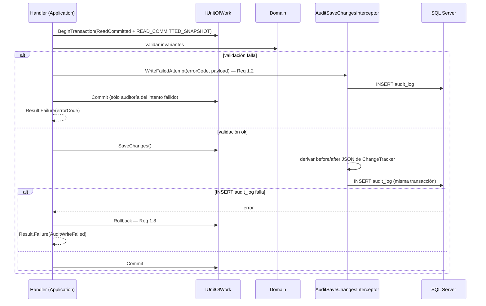
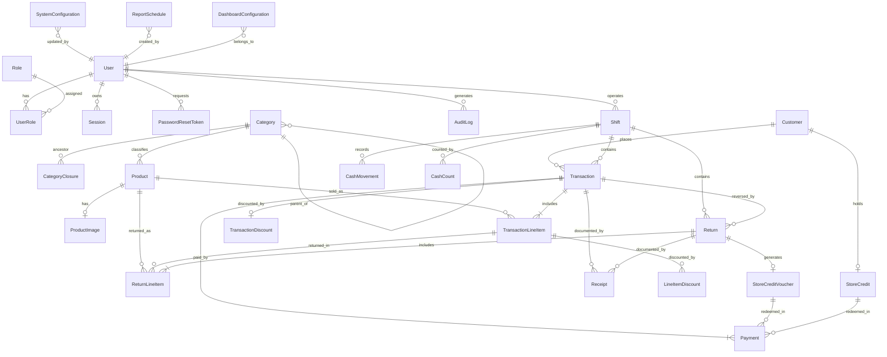
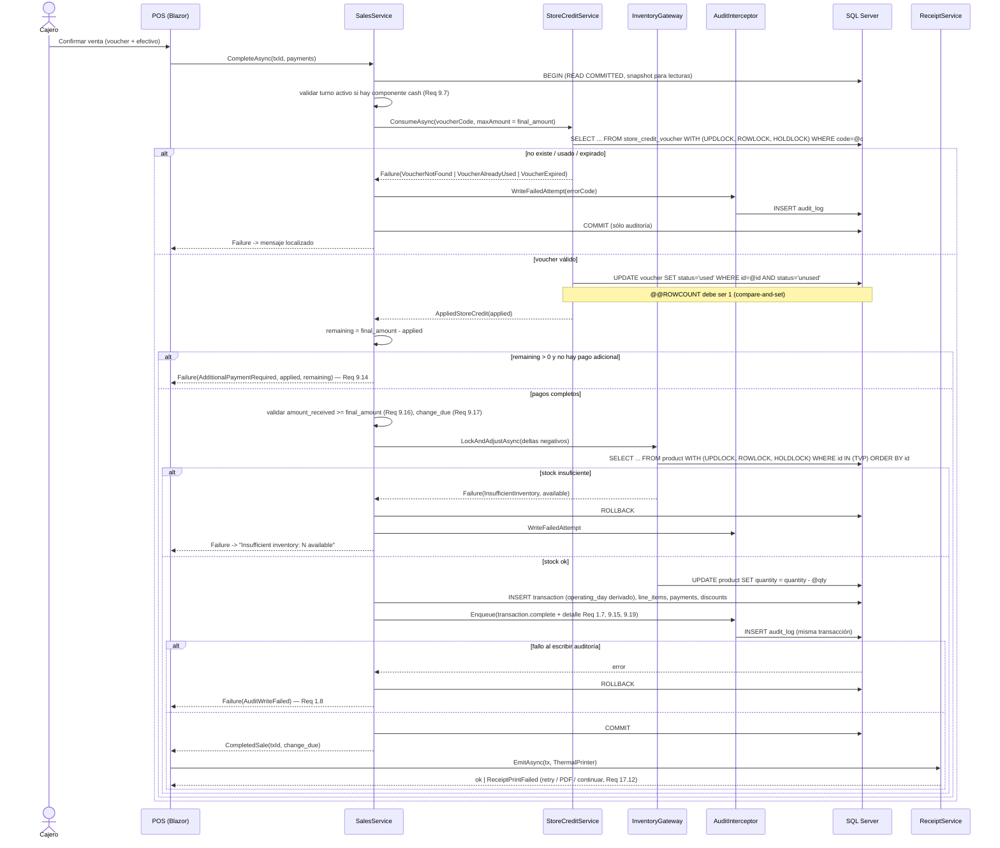
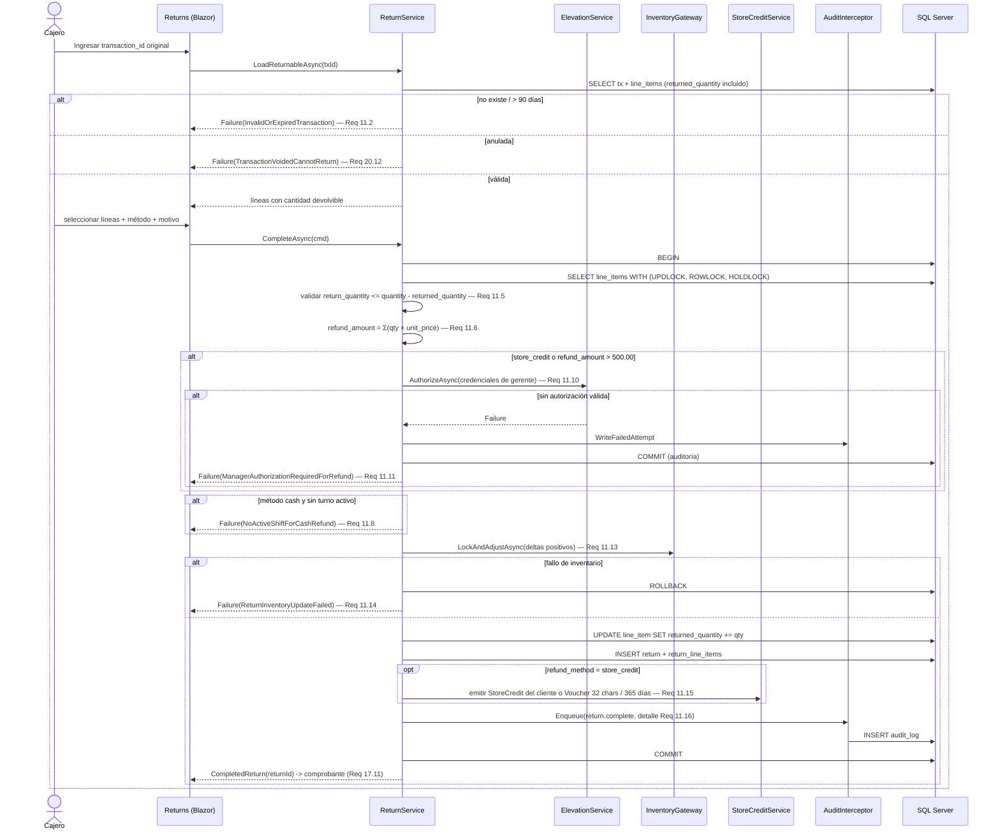
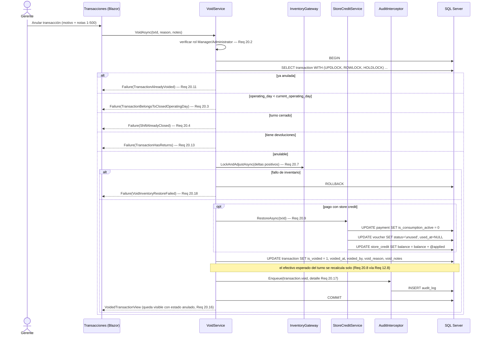
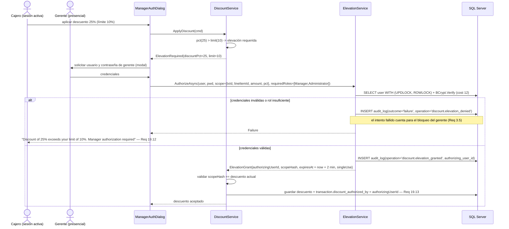

# Design Document — Sistema POS Auditable

## Overview

Este documento define el diseño técnico de un sistema de punto de venta (POS) web responsivo en .NET 8, cuyo diferenciador central es la **auditabilidad**: toda operación que modifica datos deja una entrada inmutable en `AuditLog`, escrita en la misma transacción de base de datos que la operación, y si la auditoría falla la operación no persiste (Req 1.1, 1.2, 1.8).

El sistema cubre 20 áreas de requisitos: auditoría (Req 1), usuarios y roles (Req 2, 5), autenticación y recuperación de contraseña (Req 3, 4), UI responsiva (Req 6), informes (Req 7), dashboard (Req 8), ventas (Req 9), inventario (Req 10), devoluciones (Req 11), turnos de caja (Req 12), clientes (Req 13), categorías jerárquicas (Req 14), márgenes de ganancia (Req 15), imágenes de producto (Req 16), comprobantes (Req 17), búsqueda y código de barras (Req 18), descuentos (Req 19) y anulaciones (Req 20).

### Principios de diseño

| Principio | Implicancia concreta | Requisitos |
|---|---|---|
| Auditoría atómica | El `AuditLog` se escribe en la misma transacción DB que la operación; fallo de auditoría ⇒ rollback | 1.1, 1.8 |
| Inmutabilidad verificable | La inmutabilidad se garantiza en la base de datos (permisos + trigger), no sólo en el código | 1.3 |
| Dinero exacto | `decimal` en C#, `decimal(18,2)` en SQL Server, redondeo half-up centralizado | 9.3, 15.11, 19.3 |
| Invariantes en el borde más bajo posible | Constraints y unique indexes en DB además de validación de dominio | 10.9, 18.4 |
| Nada se borra | Desactivación lógica de productos, categorías, clientes; `Void` marca, no elimina | 10.4, 13.12, 14.10, 20.10 |
| Mensajes de error exactos | Catálogo de códigos de error con recursos localizados (requisitos en inglés, UI en español) | todos los `error message` |

### Stack tecnológico (decidido)

| Componente | Elección | Justificación breve |
|---|---|---|
| Runtime | .NET 8 LTS | Soporte extendido, sin dependencias preview para un trabajo de PPS. |
| UI | ASP.NET Core + **Blazor Server** | Interactividad con estado en servidor sin API separada; latencia baja en red local, ideal para POS de caja. |
| Base de datos | **SQL Server 2022** (mínimo soportado: 2019) | `decimal` exacto, `datetime2(3)`, filtered indexes, particionado por rango en todas las ediciones desde 2016 SP1, collations *case-insensitive* y *accent-insensitive* nativas y Ledger Tables append-only en 2022. Lo que se gana: integración natural con .NET y el ecosistema Microsoft, tooling maduro (SSMS, Extended Events, Query Store), acentos resueltos por collation sin extensiones, e inmutabilidad de auditoría verificable por el motor. Lo que se pierde o se complica: no existe un índice de trigramas para resolver substring arbitrario con *seek*, el aislamiento por defecto (`READ COMMITTED` con locking) bloquea lecturas y requiere habilitar `READ_COMMITTED_SNAPSHOT`, y los arrays y el JSON nativo se reemplazan por JSON en `nvarchar(max)` validado con `ISJSON`. |
| ORM | **EF Core 8** (provider `Microsoft.EntityFrameworkCore.SqlServer`) | Interceptores de `SaveChanges` para auditoría automática, migraciones versionadas, `IsRowVersion()` sobre `rowversion`. |
| Hash de contraseñas | **BCrypt.Net-Next**, cost 12 | Los requisitos exigen bcrypt explícitamente (Req 3.1); ASP.NET Core Identity usa PBKDF2, por eso no se adopta tal cual. Se implementa autenticación propia sobre cookies de ASP.NET Core. |
| Gráficas | **ApexCharts.Blazor** | Line/bar/pie + tooltips nativos, componentes Blazor sin JS manual (Req 8.6, 8.7). |
| PDF | **QuestPDF** | API C# fluida, permite página de 80 mm para comprobantes y A4 para informes (Req 7.5, 17.3). |
| Excel | **ClosedXML** | Exportación de hasta 100.000 filas sin Interop (Req 7.5). |
| Imágenes | **ImageSharp** | Detección de formato por *magic bytes*, decodificación validante y generación de thumbnails (Req 16.5, 16.9, 16.10). |
| Email | **MailKit** | SMTP robusto con reintentos, para reset de contraseña, informes y comprobantes (Req 4.3, 7.9, 17.3). |
| Scheduler | **Quartz.NET** | Informes recurrentes, desbloqueo de cuentas, expiración de vouchers, agregados de dashboard (Req 7.7). |
| Impresión térmica | **ESC/POS vía agente local** (servicio en la máquina de caja) + fallback PDF 80 mm por impresión del navegador | Blazor Server corre en servidor y no accede a la impresora del cliente; el agente local expone `http://localhost:9100/print` y el fallback cubre su ausencia (Req 17.3, 17.12). |
| Código de barras | **Escáner USB en modo HID** (teclado) + lectura por cámara como opción secundaria | Sin drivers ni JS interop; el escáner "tipea" el código y termina con Enter. La cámara (ZXing vía JS interop) queda como alternativa en tablets (Req 18.11, 18.12). |
| Testing | **xUnit** + **CsCheck** (property-based) + **Testcontainers** (`Testcontainers.MsSql`, SQL Server real) | CsCheck es idiomático .NET y soporta shrinking y modelos concurrentes; Testcontainers permite verificar triggers, constraints y concurrencia real. |

---

## Architecture

### Capas

```
Presentation (Blazor Server)  →  Application (casos de uso)  →  Domain (entidades, invariantes)
                                          ↓
                              Infrastructure (EF Core, SQL Server, PDF, email, imágenes, impresión)
```

- **Domain**: entidades, value objects (`Money`, `Percentage`, `Barcode`, `Denomination`), invariantes y reglas puras. Sin dependencias externas.
- **Application**: casos de uso (`CompleteSaleHandler`, `ProcessReturnHandler`, `VoidTransactionHandler`, `CloseShiftHandler`…), interfaces de puertos (`IProductRepository`, `IAuditWriter`, `IReceiptRenderer`, `IEmailSender`, `IClock`), validación y orquestación transaccional. Devuelve `Result<T>` con `ErrorCode`.
- **Infrastructure**: `PosDbContext`, repositorios, `AuditSaveChangesInterceptor`, `BCryptPasswordHasher`, `QuestPdfReceiptRenderer`, `EscPosPrinterGateway`, `ImageSharpImageProcessor`, `MailKitEmailSender`, jobs Quartz.
- **Presentation**: componentes y páginas Blazor, layout responsivo, guardas de autorización, mapeo `ErrorCode → mensaje localizado`.

Regla de dependencia: Presentation → Application → Domain; Infrastructure → Application/Domain (implementa puertos). Domain no referencia nada.

### Diagrama de componentes

```mermaid
graph TB
    subgraph Client["Cliente (320px - 2560px)"]
        Browser["Navegador<br/>Blazor circuit (SignalR)"]
        Scanner["Escáner USB HID"]
        Agent["Agente local ESC/POS<br/>localhost:9100"]
    end

    subgraph Presentation["Presentation — Blazor Server"]
        Pages["Pages: POS, Inventory, Shifts,<br/>Returns, Reports, Dashboard, Admin"]
        Comps["Componentes: ResponsiveTable,<br/>ProductThumbnail, ChartWidget,<br/>ManagerAuthDialog, MoneyInput"]
        AuthUI["Cookie auth + AuthorizationPolicies"]
        Loc["ErrorMessageLocalizer<br/>(es-AR / en-US)"]
    end

    subgraph Application["Application"]
        Sales["SalesService"]
        Returns["ReturnService"]
        Voids["VoidService"]
        Shifts["ShiftService"]
        Inv["InventoryService"]
        Cat["CategoryService"]
        Margin["MarginService"]
        Search["ProductSearchService"]
        Disc["DiscountService"]
        Auth["AuthenticationService<br/>+ ElevationService"]
        Users["UserService"]
        Cust["CustomerService"]
        Rep["ReportEngine"]
        Dash["DashboardService"]
        Rcpt["ReceiptService"]
        Img["ProductImageService"]
        Audit["IAuditWriter"]
    end

    subgraph Domain["Domain"]
        Ents["Entities + Aggregates"]
        VOs["Value Objects: Money, Percentage,<br/>Barcode, OperatingDay"]
        Rules["Reglas: cálculo de totales,<br/>margen efectivo, efectivo esperado"]
    end

    subgraph Infrastructure["Infrastructure"]
        EFC["PosDbContext + Repositorios<br/>+ AuditSaveChangesInterceptor"]
        Hash["BCryptPasswordHasher (cost 12)"]
        PDF["QuestPDF Renderer"]
        XLS["ClosedXML Exporter"]
        ImgP["ImageSharp Processor"]
        Mail["MailKit Sender"]
        Sched["Quartz Jobs"]
        Esc["EscPosPrinterGateway"]
    end

    subgraph Data["Datos"]
        PG[("SQL Server 2022<br/>audit_log particionado append-only")]
        Files[("Almacenamiento de imágenes<br/>filesystem + thumbnails")]
    end

    Browser -->|SignalR| Pages
    Scanner -->|keystrokes| Browser
    Comps --> Agent
    Pages --> Comps
    Pages --> AuthUI
    Pages --> Loc
    Pages --> Application
    Application --> Domain
    Application --> Audit
    Application --> Infrastructure
    Esc --> Agent
    EFC --> PG
    ImgP --> Files
    Sched --> Application
```



### Flujo transaccional estándar (invariante de auditoría)

Todo caso de uso que modifica datos sigue el mismo esqueleto:



---

## Components and Interfaces

Cada componente indica los requisitos que satisface.

### Application — contratos principales

```csharp
// Resultado uniforme; nunca se usan excepciones para fallos esperados.
public readonly record struct Error(ErrorCode Code, IReadOnlyDictionary<string, object?> Args);
public class Result<T> { bool IsSuccess; T? Value; Error? Error; }

public interface IAuditWriter                                  // Req 1.1, 1.2, 1.6, 1.8
{
    void Enqueue(AuditEntryDraft draft);                       // se materializa en SaveChanges
    Task WriteFailedAttemptAsync(ErrorCode code, AuditContext ctx, CancellationToken ct);
}

public interface ISalesService                                  // Req 9, 18.11-18.16, 19
{
    Task<Result<OpenTransactionView>> AddLineItemAsync(Guid txId, Guid productId, int qty, CancellationToken ct);
    Task<Result<OpenTransactionView>> AddByBarcodeAsync(Guid txId, string barcode, CancellationToken ct);
    Task<Result<OpenTransactionView>> ApplyLineDiscountAsync(ApplyDiscountCommand cmd, CancellationToken ct);
    Task<Result<CompletedSale>> CompleteAsync(CompleteSaleCommand cmd, CancellationToken ct);
}

public interface IReturnService                                 // Req 11
{
    Task<Result<ReturnableTransactionView>> LoadReturnableAsync(Guid originalTxId, CancellationToken ct);
    Task<Result<CompletedReturn>> CompleteAsync(CompleteReturnCommand cmd, CancellationToken ct);
}

public interface IVoidService                                   // Req 20
{
    Task<Result<VoidedTransactionView>> VoidAsync(VoidCommand cmd, CancellationToken ct);
}

public interface IShiftService                                  // Req 12
{
    Task<Result<Shift>> OpenAsync(OpenShiftCommand cmd, CancellationToken ct);
    Task<Result<Money>> GetExpectedCashAsync(Guid shiftId, CancellationToken ct);   // Req 12.8
    Task<Result<ShiftSummary>> CloseAsync(CloseShiftCommand cmd, CancellationToken ct);
    Task<Result<CashMovement>> RecordMovementAsync(CashMovementCommand cmd, CancellationToken ct);
}

public interface IInventoryReservationGateway                    // Req 9.21, 9.22, 11.13, 20.7
{
    // Bloquea filas de producto con WITH (UPDLOCK, ROWLOCK, HOLDLOCK) en orden
    // determinístico (product_id ASC) dentro de la transacción actual. Ver D4.
    Task<Result<IReadOnlyDictionary<Guid, int>>> LockAndAdjustAsync(
        IReadOnlyList<StockDelta> deltas, CancellationToken ct);
}

public interface IStoreCreditService                             // Req 9.8-9.15, 11.15, 20.9
{
    Task<Result<AppliedStoreCredit>> ConsumeAsync(StoreCreditRequest req, Money maxAmount, CancellationToken ct);
    Task<Result<Unit>> RestoreAsync(Guid transactionId, CancellationToken ct);
}

public interface IMarginService                                  // Req 15
{
    Task<EffectiveMargin> ResolveAsync(Guid productId, CancellationToken ct);   // producto > ancestro > global
    Money CalculateSuggestedPrice(Money costPrice, Percentage margin);
}

public interface ICategoryTreeService                            // Req 14
{
    Task<Result<Category>> CreateAsync(CreateCategoryCommand cmd, CancellationToken ct);  // valida profundidad
    Task<Result<Category>> MoveAsync(Guid categoryId, Guid? newParentId, CancellationToken ct); // valida ciclos
    Task<IReadOnlyList<Guid>> GetDescendantIdsAsync(Guid categoryId, CancellationToken ct);
}

public interface IProductSearchService                           // Req 18.6-18.10
{
    Task<Result<Product>> FindByBarcodeAsync(string barcode, CancellationToken ct);   // < 1 s
    Task<Result<Product>> FindBySkuAsync(string sku, CancellationToken ct);           // < 1 s
    Task<Result<SearchPage>> SearchByNameAsync(string term, CancellationToken ct);    // < 2 s, top 50
}

public interface IElevationService                               // Req 19.11-19.13, 11.10-11.11
{
    // Verifica credenciales de un Manager/Administrator SIN alterar la sesión del cajero.
    Task<Result<ElevationGrant>> AuthorizeAsync(ElevationRequest req, CancellationToken ct);
}

public interface IReceiptService                                 // Req 17
{
    Task<Result<ReceiptDocument>> EmitAsync(ReceiptSource src, ReceiptChannel channel, CancellationToken ct);
    Task<Result<ReceiptDocument>> ReprintAsync(Guid txOrReturnId, ReceiptChannel channel, CancellationToken ct);
}
```

### Presentation — componentes reutilizables

| Componente | Responsabilidad | Requisitos |
|---|---|---|
| `MainLayout` + `NavMenu` | Navegación horizontal ≥768px, apilada vertical <768px (CSS puro, sin round-trip) | 6.2 |
| `ResponsiveTable<T>` | Renderiza `<table>` en escritorio y lista de tarjetas en móvil desde el mismo markup, con indicador de scroll cuando corresponde | 6.6 |
| `ProductThumbnail` | 200×200 escritorio / 80×80 móvil, `width`/`height` reservados, `onerror` → `Image_Placeholder` | 16.17-16.21 |
| `MoneyInput` / `MoneyDisplay` | Entrada y formato `decimal` con 2 decimales y moneda configurada | 9.3 |
| `BarcodeCaptureField` | Campo con foco permanente que interpreta ráfagas del escáner HID terminadas en Enter | 18.11, 18.12 |
| `ManagerAuthDialog` | Diálogo de autorización de gerente que no cierra la sesión del cajero | 19.11 |
| `ChartWidget` | Envoltura de ApexCharts con tipo, tooltip y estado de error/vacío | 8.5-8.7, 8.10 |
| `ErrorAlert` | Muestra `ErrorCode` localizado con `aria-live="assertive"` | catálogo de errores |
| `ShiftCashCountForm` | Desglose por denominación con total calculado y validación de varianza | 12.1, 12.9-12.12 |

### Infrastructure — adaptadores

| Adaptador | Notas | Requisitos |
|---|---|---|
| `AuditSaveChangesInterceptor` | Deriva `before/after` JSON del `ChangeTracker`, inserta en `audit_log` dentro de la misma transacción | 1.1, 1.6, 1.7 |
| `SqlServerInventoryReservationGateway` | Único lugar con SQL crudo de bloqueo: `SELECT ... WITH (UPDLOCK, ROWLOCK, HOLDLOCK)` vía `FromSqlInterpolated` con table-valued parameter, orden por `product_id`, y ajuste de stock con `ExecuteSqlInterpolated` | 9.21, 9.22, 11.13, 20.7 |
| `BCryptPasswordHasher` | `BCrypt.HashPassword(pwd, workFactor: 12)`; verificación *dummy* para igualar tiempos | 3.1, 3.2 |
| `EscPosPrinterGateway` | POST al agente local; timeout 5 s; en fallo devuelve `ReceiptPrintFailed` con opciones reintentar/PDF/continuar | 17.3, 17.12 |
| `QuestPdfReceiptRenderer` | Perfil 80 mm (comprobantes) y A4 (informes) | 17.3, 7.5 |
| `ImageSharpImageProcessor` | `Image.DetectFormat` sobre bytes, decodificación completa, thumbnail 200×200 con letterbox | 16.5, 16.9, 16.10 |
| `MailKitEmailSender` | 3 reintentos con backoff exponencial; registra el fallo definitivo en `AuditLog` | 4.4, 7.8, 17.6 |
| Jobs Quartz | `UnlockExpiredAccountsJob`, `ExpireVouchersJob`, `ScheduledReportJob`, `RefreshDashboardAggregatesJob`, `PurgeExpiredResetTokensJob` | 3.8, 7.7, 8.9 |

---

## Data Models

### Diagrama ER



### Convenciones

- **Claves primarias**: `uniqueidentifier` con UUID v4 **generado en la aplicación** (`Guid.NewGuid()`), no con `NEWID()` en la base (Req 9.18, 11.12, 12.4, 13.4, 14.3, 16.10). Generar en la aplicación permite conocer el id antes de persistir —necesario para armar la entrada de `AuditLog` y las relaciones en la misma unidad de trabajo— y mantiene el mismo valor en logs, comprobantes y base. `NEWID()` queda sólo como *default* defensivo para cargas manuales o inserciones fuera de la aplicación. El costo clásico de los GUID aleatorios (fragmentación del índice clusterizado) se mitiga de forma explícita: la PK se declara `PRIMARY KEY NONCLUSTERED` y el **clustered index** se coloca sobre la columna que gobierna el acceso por rango de cada tabla (`transaction` y `return` por `(operating_day, completed_at)`, `audit_log` por `(occurred_at, id)`, `payment` y `transaction_line_item` por `(transaction_id)`). En las tablas de catálogo, de bajo volumen y sin patrón de rango (`user`, `role`, `category`, `product`, `customer`), la PK queda clusterizada: el tamaño no justifica la complejidad. No se usa `NEWSEQUENTIALID()` porque revela el orden de creación y no produce UUID v4.
- **Timestamps**: `datetime2(3)` almacenando **siempre UTC**, con `IClock` (`DateTimeOffset UtcNow`) como única fuente de tiempo del dominio. Se descarta `datetimeoffset(3)`: por convención *todo* instante persistido es UTC, así que el offset guardado sería invariablemente `+00:00` —información redundante en cada fila— mientras que la conversión a la zona del negocio ocurre en un único lugar (`OperatingDay` y la capa de presentación) a partir de `SystemConfiguration.business_time_zone`. Guardar el offset invitaría a persistir horas locales y a comparar instantes con offsets distintos, que es justamente el error que la convención estricta previene. Se verifica con un test de arquitectura: toda propiedad temporal es `DateTimeOffset` en C# mapeada a `datetime2(3)` UTC, y `DateTime.Now`/`DateTime.UtcNow` están prohibidos fuera de `IClock`. El equivalente en el motor es `SYSUTCDATETIME()` (nunca `GETDATE()`, que devuelve hora local del servidor), y se usa **sólo** como *default* de columna en scripts administrativos o cargas manuales: ningún camino de la aplicación toma la hora de la base, porque eso volvería no determinísticos los tests de expiración de sesiones, de vouchers y de `Operating_Day`.
- **Fechas de negocio**: `date` para `operating_day` (se mantiene sin cambios; es un día calendario, no un instante).
- **Dinero**: `decimal(18,2)`. **Porcentajes**: `decimal(5,2)`.
- **Cantidades de inventario**: `int` con `CHECK (quantity >= 0)`. Enteros chicos acotados: `smallint`; secuencias legibles: `bigint`.
- **Booleanos**: `bit` con `DEFAULT 0` / `DEFAULT 1`. Los `CHECK` comparan contra `0`/`1` (`is_voided = 0`, `is_consumption_active = 1`), nunca contra `true`/`false`.
- **Texto**: `nvarchar(n)` para todo texto ingresado por personas (nombres, direcciones, descripciones, notas, nombres de archivo original) por soporte Unicode completo —imprescindible con datos argentinos: acentos, `ñ`, `°`, y eventualmente emojis en notas—; `varchar(n)` para códigos técnicos de alfabeto ASCII acotado (SKU, barcode, `currency_code`, códigos de enumeración, `user_agent`, identificadores de caja, zona horaria IANA). La distinción no es cosmética: `nvarchar` duplica el almacenamiento y reduce la longitud máxima de clave indexable, así que se paga sólo donde aporta.
- **Unicidad case-insensitive**: se resuelve con **collation de columna** `Latin1_General_100_CI_AS` más un índice único directo, en lugar de un índice sobre la expresión `LOWER(col)`. La diferencia práctica: con collation CI el índice es *sargable* para las consultas tal como se escriben (`WHERE username = @u`), no hace falta normalizar el término en cada query ni recordar aplicar la misma función a ambos lados, y las restricciones `UNIQUE` comparan con el mismo criterio que las búsquedas. Reproducir el enfoque de un índice funcional en SQL Server exigiría una columna computada persistida `LOWER(col)` más su índice, y escribir `LOWER(col) = LOWER(@u)` en todos los llamados.
- **Concurrencia optimista**: columna `row_version` de tipo `rowversion` (sinónimo de `timestamp`), mapeada con `IsRowVersion()` de EF Core. La mantiene el motor en cada `UPDATE`; la aplicación nunca la escribe.
- **JSON**: `nvarchar(max)` con `CHECK (ISJSON(col) = 1)`. Se consulta con `JSON_VALUE` para escalares y `OPENJSON` para arrays y proyecciones tabulares. SQL Server no tiene un tipo JSON binario indexable: cuando un campo JSON necesite filtrado eficiente se expondrá con una **columna computada persistida** `JSON_VALUE(col, '$.path')` más un índice sobre ella. Ningún caso de uso actual lo requiere: el JSON se lee siempre por clave primaria de su fila.
- **Colecciones**: SQL Server no tiene tipo array. Las colecciones cortas se guardan como array JSON en `nvarchar(max)` validado con `ISJSON` (ver `audit_log.related_entity_ids` y `report_schedule.recipients`).
- **Borrado lógico**: `is_active` / `is_deactivated`; nunca `DELETE` de datos de negocio.

### Entidades

#### User (Req 2.1, 2.7, 3.1, 3.5, 3.8)

| Campo | Tipo | Restricciones |
|---|---|---|
| id | uniqueidentifier | PK |
| username | varchar(50) COLLATE Latin1_General_100_CI_AS | NOT NULL, `UNIQUE` directo (la collation CI hace la unicidad case-insensitive), 1-50 |
| email | varchar(100) COLLATE Latin1_General_100_CI_AS | NOT NULL, `UNIQUE` directo (case-insensitive por collation), formato válido |
| password_hash | varchar(72) | NOT NULL, bcrypt cost 12 |
| full_name | nvarchar(100) | NOT NULL |
| is_active | bit | NOT NULL DEFAULT 1 |
| failed_login_count | smallint | NOT NULL DEFAULT 0 |
| failed_window_started_at | datetime2(3) | NULL — inicio de la ventana de 15 min |
| locked_until | datetime2(3) | NULL — bloqueo de 30 min |
| created_at / updated_at | datetime2(3) | NOT NULL |
| row_version | rowversion (`timestamp`) | Concurrencia optimista (mapeo `IsRowVersion()` de EF Core) |

#### Role (Req 2.4)

| Campo | Tipo | Restricciones |
|---|---|---|
| id | uniqueidentifier | PK |
| name | varchar(20) | NOT NULL UNIQUE, `IN ('Administrator','Manager','Cashier','Viewer')` |
| description | nvarchar(200) | NULL |

Semilla fija de 4 filas; no se crean roles en runtime.

#### UserRole (Req 2.1, 2.7, 2.8, 5.3)

| Campo | Tipo | Restricciones |
|---|---|---|
| user_id | uniqueidentifier | PK compuesta, FK → User |
| role_id | uniqueidentifier | PK compuesta, FK → Role |
| assigned_at | datetime2(3) | NOT NULL |
| assigned_by | uniqueidentifier | FK → User |

Invariante "último administrador" (Req 2.8, 5.6): se valida contando las filas de rol Administrator **con bloqueo explícito** dentro de la transacción de borrado, para que dos borrados simultáneos no puedan dejar el sistema sin administradores:

```sql
SELECT COUNT(*) FROM dbo.user_role WITH (UPDLOCK, HOLDLOCK)
 WHERE role_id = @administratorRoleId;
```

`HOLDLOCK` mantiene el lock de rango hasta el fin de la transacción, de modo que la condición verificada sigue siendo cierta al momento del `DELETE`.

#### Session (Req 3.3, 3.6, 3.7, 4.9)

| Campo | Tipo | Restricciones |
|---|---|---|
| id | uniqueidentifier | PK |
| user_id | uniqueidentifier | NOT NULL, FK → User |
| token_hash | varbinary(32) | NOT NULL UNIQUE — SHA-256 del token de 256 bits; el token en claro nunca se persiste |
| created_at | datetime2(3) | NOT NULL |
| expires_at | datetime2(3) | NOT NULL = created_at + 8 h |
| revoked_at | datetime2(3) | NULL |
| ip_address | varchar(45) | NULL — soporta IPv6 |
| user_agent | varchar(400) | NULL |

#### PasswordResetToken (Req 4.1, 4.5, 4.6, 4.8, 4.10)

| Campo | Tipo | Restricciones |
|---|---|---|
| id | uniqueidentifier | PK |
| user_id | uniqueidentifier | NOT NULL, FK → User |
| token_hash | varbinary(32) | NOT NULL UNIQUE — SHA-256 del token de 256 bits |
| created_at | datetime2(3) | NOT NULL |
| expires_at | datetime2(3) | NOT NULL = created_at + 24 h |
| consumed_at | datetime2(3) | NULL |
| invalidated_at | datetime2(3) | NULL — al emitir un token nuevo |

**Filtered index** para garantizar un único token vigente por usuario (Req 4.8):

```sql
CREATE UNIQUE INDEX ux_password_reset_token_active
  ON dbo.password_reset_token (user_id)
  WHERE consumed_at IS NULL AND invalidated_at IS NULL;
```

El predicado usa sólo `AND` de comparaciones simples, que es lo que admiten los filtered indexes de SQL Server (no se permiten `OR`, subconsultas ni expresiones complejas).

#### Category (Req 14.1-14.12, 15.5)

| Campo | Tipo | Restricciones |
|---|---|---|
| id | uniqueidentifier | PK |
| name | nvarchar(100) COLLATE Latin1_General_100_CI_AS | NOT NULL, 1-100 — la collation CI hace la unicidad por nivel case-insensitive |
| parent_category_id | uniqueidentifier | NULL, FK → Category |
| description | nvarchar(500) | NULL |
| display_order | int | NOT NULL, `BETWEEN 1 AND 9999` |
| profit_margin_percentage | decimal(5,2) | NULL, `BETWEEN 0 AND 1000` |
| depth | smallint | NOT NULL, `BETWEEN 1 AND 5` — derivado, mantenido por la aplicación |
| is_active | bit | NOT NULL DEFAULT 1 |
| created_at / updated_at | datetime2(3) | NOT NULL |

Un **único** índice cubre Req 14.2, incluidas las categorías raíz:

```sql
CREATE UNIQUE INDEX ux_category_parent_name
  ON dbo.category (parent_category_id, name);   -- name con collation CI
```

Dos detalles de SQL Server que simplifican esto frente al enfoque con índices sobre `LOWER(name)`: (1) la collation `_CI_AS` de la columna hace que `'Bebidas'` y `'bebidas'` colisionen sin envolver la columna en una función, manteniendo el índice utilizable en las búsquedas; (2) SQL Server considera **dos `NULL` como iguales** en un índice único, por lo que las categorías raíz (`parent_category_id IS NULL`) quedan cubiertas por el mismo índice y **no** hace falta un filtered index adicional para ellas.

#### CategoryClosure (Req 14.6, 14.9, 14.14, 14.16, 15.8)

| Campo | Tipo | Restricciones |
|---|---|---|
| ancestor_id | uniqueidentifier | PK compuesta, FK → Category |
| descendant_id | uniqueidentifier | PK compuesta, FK → Category |
| depth | smallint | NOT NULL, 0 = self, `<= 4` |

Tabla derivada mantenida transaccionalmente; ver "Jerarquía de categorías" en Decisiones de diseño.

#### Product (Req 10.1-10.10, 15.9-15.13, 18.1-18.5)

| Campo | Tipo | Restricciones |
|---|---|---|
| id | uniqueidentifier | PK |
| sku | varchar(50) | NOT NULL, UNIQUE (incluye desactivados, Req 10.9) |
| name | nvarchar(100) COLLATE Latin1_General_100_CI_AI | NOT NULL, 1-100 — collation *case* y *accent insensitive*: `"cafe"` encuentra `"Café"` sin normalizar nada (Req 18.8) |
| description | nvarchar(500) | NULL |
| barcode | varchar(48) | NULL, UNIQUE (incluye desactivados, Req 18.4) |
| barcode_format | varchar(10) | NULL, `IN ('EAN13','UPCA','CODE128')` |
| category_id | uniqueidentifier | NOT NULL, FK → Category (exactamente una, Req 14.13) |
| sale_price | decimal(18,2) | NOT NULL, `BETWEEN 0.01 AND 999999.99` |
| cost_price | decimal(18,2) | NOT NULL, `BETWEEN 0.01 AND 999999.99` |
| profit_margin_percentage | decimal(5,2) | NULL, `BETWEEN 0 AND 1000` |
| is_price_manually_overridden | bit | NOT NULL DEFAULT 0 |
| price_override_by | uniqueidentifier | NULL, FK → User |
| price_override_at | datetime2(3) | NULL |
| quantity | int | NOT NULL, `BETWEEN 0 AND 999999` |
| min_stock_threshold | int | NOT NULL, `BETWEEN 0 AND 999999` |
| is_deactivated | bit | NOT NULL DEFAULT 0 |
| created_at / updated_at | datetime2(3) | NOT NULL |
| row_version | rowversion (`timestamp`) | Concurrencia optimista para edición de catálogo (mapeo `IsRowVersion()` de EF Core) |

`low_stock` es calculado (`quantity <= min_stock_threshold`), no persistido (Req 10.2).

#### ProductImage (Req 16.1-16.15, 16.23-16.25)

| Campo | Tipo | Restricciones |
|---|---|---|
| id | uniqueidentifier | PK |
| product_id | uniqueidentifier | NOT NULL, **UNIQUE** (máximo una imagen por producto, Req 16.3), FK → Product |
| original_file_name | nvarchar(255) | NOT NULL, 1-255 |
| content_type | varchar(20) | NOT NULL, `IN ('image/jpeg','image/png','image/webp')` |
| byte_size | int | NOT NULL, `BETWEEN 1 AND 5242880` |
| width_px / height_px | int | NOT NULL, `<= 4000` |
| storage_path | nvarchar(400) | NOT NULL |
| thumbnail_path | nvarchar(400) | NOT NULL |
| uploaded_by | uniqueidentifier | NOT NULL, FK → User |
| uploaded_at | datetime2(3) | NOT NULL |

#### Customer (Req 13.1-13.14)

| Campo | Tipo | Restricciones |
|---|---|---|
| id | uniqueidentifier | PK |
| name | nvarchar(100) COLLATE Latin1_General_100_CI_AI | NOT NULL, 1-100 — collation *accent insensitive* para la búsqueda por nombre (Req 13.5) |
| email | varchar(100) COLLATE Latin1_General_100_CI_AS | NULL, `UNIQUE` directo (case-insensitive por collation, Req 13.2) |
| phone | varchar(20) | NULL, 7-20 (dígitos + formato); índice **no** único (Req 13.3 sólo advierte) |
| phone_normalized | varchar(20) | NULL — sólo dígitos, para búsqueda parcial |
| notes | nvarchar(500) | NULL |
| is_active | bit | NOT NULL DEFAULT 1 |
| created_at | datetime2(3) | NOT NULL |
| created_by | uniqueidentifier | NOT NULL, FK → User |

Estadísticas de por vida (Req 13.14) se calculan por agregación sobre `Transaction` no anulada.

#### Transaction (Req 9.3, 9.18-9.20, 13.8, 15.22, 19.13, 20.10)

| Campo | Tipo | Restricciones |
|---|---|---|
| id | uniqueidentifier | PK (UUID v4) |
| transaction_number | bigint | NOT NULL UNIQUE — secuencia legible para el comprobante |
| completed_at | datetime2(3) | NOT NULL — UTC |
| operating_day | date | NOT NULL — derivado en la zona horaria del negocio, persistido al completar |
| user_id | uniqueidentifier | NOT NULL, FK → User |
| shift_id | uniqueidentifier | NULL, FK → Shift (NULL en pagos con tarjeta sin turno, Req 9.20) |
| customer_id | uniqueidentifier | NULL, FK → Customer |
| subtotal | decimal(18,2) | NOT NULL, `>= 0` |
| tax_amount | decimal(18,2) | NOT NULL, `>= 0` |
| discount_amount | decimal(18,2) | NOT NULL, `>= 0` |
| final_amount | decimal(18,2) | NOT NULL, `CHECK (final_amount >= 0 AND final_amount = subtotal + tax_amount - discount_amount)` |
| amount_received | decimal(18,2) | NOT NULL, `>= final_amount` |
| change_due | decimal(18,2) | NOT NULL, `>= 0` |
| tax_rate_applied | decimal(5,2) | NOT NULL — congelado al completar |
| discount_authorized_by | uniqueidentifier | NULL, FK → User (Req 19.13) |
| is_voided | bit | NOT NULL DEFAULT 0 |
| voided_at | datetime2(3) | NULL |
| voided_by | uniqueidentifier | NULL, FK → User |
| void_reason | varchar(30) | NULL, `IN ('cashier_error','customer_cancellation','pricing_error','duplicate_transaction','other')` |
| void_notes | nvarchar(500) | NULL, 1-500 cuando `is_voided` |

`CHECK (is_voided = 0 OR (voided_at IS NOT NULL AND voided_by IS NOT NULL AND void_reason IS NOT NULL AND LEN(void_notes) BETWEEN 1 AND 500))` (Req 20.5, 20.6).

#### TransactionLineItem (Req 9.1, 9.3, 15.22, 18.16)

| Campo | Tipo | Restricciones |
|---|---|---|
| id | uniqueidentifier | PK |
| transaction_id | uniqueidentifier | NOT NULL, FK → Transaction |
| product_id | uniqueidentifier | NOT NULL, FK → Product |
| product_name_snapshot | nvarchar(100) | NOT NULL — nombre al momento de la venta |
| quantity | int | NOT NULL, `BETWEEN 1 AND 9999` |
| unit_price | decimal(18,2) | NOT NULL, `BETWEEN 0.01 AND 999999.99` |
| recorded_cost_price | decimal(18,2) | NULL — costo al completar (Req 15.22, 15.25) |
| line_discount_amount | decimal(18,2) | NOT NULL DEFAULT 0, `>= 0` |
| line_amount | decimal(18,2) | NOT NULL = `quantity * unit_price - line_discount_amount`, `>= 0` |
| returned_quantity | int | NOT NULL DEFAULT 0, `CHECK (returned_quantity BETWEEN 0 AND quantity)` |

`UNIQUE (transaction_id, product_id)` — el escaneo repetido incrementa cantidad en lugar de crear líneas (Req 18.12).

#### Payment (Req 9.6, 9.8, 9.13-9.15)

| Campo | Tipo | Restricciones |
|---|---|---|
| id | uniqueidentifier | PK |
| transaction_id | uniqueidentifier | NOT NULL, FK → Transaction |
| method | varchar(20) | NOT NULL, `IN ('cash','credit_card','debit_card','store_credit')` |
| amount | decimal(18,2) | NOT NULL, `> 0` |
| voucher_id | uniqueidentifier | NULL, FK → StoreCreditVoucher |
| store_credit_customer_id | uniqueidentifier | NULL, FK → Customer |
| is_consumption_active | bit | NOT NULL DEFAULT 1 — pasa a `0` al anular (Req 20.9) |
| created_at | datetime2(3) | NOT NULL |

**Filtered index** como barrera de doble gasto a nivel de motor:

```sql
CREATE UNIQUE INDEX ux_payment_voucher_active
  ON dbo.payment (voucher_id)
  WHERE voucher_id IS NOT NULL AND is_consumption_active = 1;
```

`CHECK (method <> 'store_credit' OR voucher_id IS NOT NULL OR store_credit_customer_id IS NOT NULL)`.

#### LineItemDiscount (Req 19.1, 19.14, 19.18)

| Campo | Tipo | Restricciones |
|---|---|---|
| id | uniqueidentifier | PK |
| line_item_id | uniqueidentifier | NOT NULL UNIQUE, FK → TransactionLineItem |
| discount_type | varchar(10) | NOT NULL, `IN ('percentage','fixed')` |
| percentage | decimal(5,2) | NULL, `BETWEEN 0 AND 100` |
| amount | decimal(18,2) | NOT NULL, `>= 0` |
| reason | varchar(30) | NOT NULL, `IN ('promotion','frequent_customer','damaged_product','management_authorization','other')` |
| notes | nvarchar(200) | NULL |
| applied_by | uniqueidentifier | NOT NULL, FK → User |
| authorized_by | uniqueidentifier | NULL, FK → User |

#### TransactionDiscount (Req 19.2, 19.3)

Misma forma que `LineItemDiscount` con `transaction_id uniqueidentifier NOT NULL UNIQUE` en lugar de `line_item_id`, y `amount <= subtotal`.

#### Return (Req 11.1-11.16)

| Campo | Tipo | Restricciones |
|---|---|---|
| id | uniqueidentifier | PK (UUID v4) |
| original_transaction_id | uniqueidentifier | NOT NULL, FK → Transaction |
| completed_at | datetime2(3) | NOT NULL |
| operating_day | date | NOT NULL |
| user_id | uniqueidentifier | NOT NULL, FK → User |
| shift_id | uniqueidentifier | NULL, FK → Shift — NOT NULL cuando `refund_method = 'cash'` (Req 11.8, 11.9) |
| refund_amount | decimal(18,2) | NOT NULL, `> 0` |
| refund_method | varchar(25) | NOT NULL, `IN ('cash','credit_card_reversal','store_credit')` |
| reason_code | varchar(20) | NOT NULL, `IN ('defective_product','customer_regret','wrong_product','other')` |
| authorized_by | uniqueidentifier | NULL, FK → User — NOT NULL si `refund_method='store_credit'` o `refund_amount > 500.00` (Req 11.10) |

#### ReturnLineItem (Req 11.4, 11.5, 11.13)

| Campo | Tipo | Restricciones |
|---|---|---|
| id | uniqueidentifier | PK |
| return_id | uniqueidentifier | NOT NULL, FK → Return |
| line_item_id | uniqueidentifier | NOT NULL, FK → TransactionLineItem |
| product_id | uniqueidentifier | NOT NULL, FK → Product |
| return_quantity | int | NOT NULL, `>= 1` |
| unit_price | decimal(18,2) | NOT NULL |
| line_refund_amount | decimal(18,2) | NOT NULL = `return_quantity * unit_price` |

`UNIQUE (return_id, line_item_id)`.

#### StoreCredit (Req 11.15, 9.12, 9.15, 20.9)

| Campo | Tipo | Restricciones |
|---|---|---|
| id | uniqueidentifier | PK |
| customer_id | uniqueidentifier | NOT NULL UNIQUE, FK → Customer |
| balance | decimal(18,2) | NOT NULL, `>= 0` |
| updated_at | datetime2(3) | NOT NULL |

#### StoreCreditVoucher (Req 9.9-9.11, 11.15, 20.9)

| Campo | Tipo | Restricciones |
|---|---|---|
| id | uniqueidentifier | PK |
| code | char(32) | NOT NULL UNIQUE, 32 alfanuméricos generados con CSPRNG |
| amount | decimal(18,2) | NOT NULL, `> 0` |
| issued_at | datetime2(3) | NOT NULL |
| expires_at | datetime2(3) | NOT NULL = issued_at + 365 días |
| status | varchar(10) | NOT NULL, `IN ('unused','used')` DEFAULT 'unused' |
| used_at | datetime2(3) | NULL |
| used_in_transaction_id | uniqueidentifier | NULL, FK → Transaction |
| origin_return_id | uniqueidentifier | NULL, FK → Return |

`CHECK ((status = 'used' AND used_at IS NOT NULL) OR (status = 'unused' AND used_at IS NULL))` — SQL Server no permite comparar predicados entre sí, así que la equivalencia lógica se escribe como disyunción de los dos casos válidos.

#### Shift (Req 12.1-12.15)

| Campo | Tipo | Restricciones |
|---|---|---|
| id | uniqueidentifier | PK (UUID v4) |
| cash_drawer_id | varchar(20) | NOT NULL, 1-20 |
| user_id | uniqueidentifier | NOT NULL, FK → User |
| opened_at | datetime2(3) | NOT NULL |
| operating_day | date | NOT NULL |
| opening_cash_amount | decimal(18,2) | NOT NULL, `BETWEEN 0 AND 999999.99` |
| status | varchar(10) | NOT NULL, `IN ('open','closed')` |
| closed_at | datetime2(3) | NULL |
| closing_cash_amount | decimal(18,2) | NULL |
| expected_cash_balance | decimal(18,2) | NULL — congelado al cerrar |
| variance_amount | decimal(18,2) | NULL = closing - expected |
| variance_status | varchar(10) | NULL, `IN ('over','short','balanced')` |
| variance_notes | nvarchar(500) | NULL — obligatorio si `ABS(variance) > 10.00` |

**Filtered indexes** (Req 12.2, 12.3):

```sql
CREATE UNIQUE INDEX ux_shift_open_drawer ON dbo.shift (cash_drawer_id) WHERE status = 'open';
CREATE UNIQUE INDEX ux_shift_open_user   ON dbo.shift (user_id)        WHERE status = 'open';
```

`CHECK (status = 'open' OR ABS(variance_amount) <= 10.00 OR LEN(variance_notes) BETWEEN 1 AND 500)` (Req 12.11, 12.12).

#### CashMovement (Req 12.5-12.7)

| Campo | Tipo | Restricciones |
|---|---|---|
| id | uniqueidentifier | PK |
| shift_id | uniqueidentifier | NOT NULL, FK → Shift |
| movement_type | varchar(10) | NOT NULL, `IN ('withdrawal','deposit')` |
| amount | decimal(18,2) | NOT NULL, `BETWEEN 0.01 AND 99999.99` |
| reason | varchar(20) | NOT NULL, retiro: `bank_deposit/change_request/other`; depósito: `change_delivery/correction/other` |
| notes | nvarchar(200) | NULL |
| user_id | uniqueidentifier | NOT NULL, FK → User |
| occurred_at | datetime2(3) | NOT NULL |

#### CashCount (Req 12.1, 12.9)

| Campo | Tipo | Restricciones |
|---|---|---|
| id | uniqueidentifier | PK |
| shift_id | uniqueidentifier | NOT NULL, FK → Shift |
| count_type | varchar(10) | NOT NULL, `IN ('opening','closing')` |
| total_amount | decimal(18,2) | NOT NULL, `BETWEEN 0 AND 999999.99` |
| breakdown | nvarchar(max) | NOT NULL, `CHECK (ISJSON(breakdown) = 1)` — `{"100.00": n, "50.00": n, ..., "0.01": n}` con las 10 denominaciones |
| counted_at | datetime2(3) | NOT NULL |
| counted_by | uniqueidentifier | NOT NULL, FK → User |

`UNIQUE (shift_id, count_type)`. Invariante de dominio: `total_amount = Σ(denominación × cantidad)`, verificada en la aplicación al construir el conteo y, en verificaciones administrativas, con `OPENJSON(breakdown)` para reconstruir la suma desde la base.

#### AuditLog (Req 1.1-1.8) — append-only, particionada

| Campo | Tipo | Restricciones |
|---|---|---|
| id | uniqueidentifier | PK compuesta con `occurred_at` (requisito del particionado) |
| occurred_at | datetime2(3) | NOT NULL — clave de partición (RANGE mensual) |
| user_id | uniqueidentifier | NULL (operaciones del sistema), FK → User |
| username_snapshot | varchar(50) | NOT NULL — resiste renombrados |
| operation_type | varchar(40) | NOT NULL — `user.create`, `transaction.complete`, `transaction.void`, `product.quantity_adjust`, `image.upload`, … |
| entity_type | varchar(40) | NOT NULL |
| entity_id | uniqueidentifier | NULL |
| related_entity_ids | nvarchar(max) | NULL, `CHECK (related_entity_ids IS NULL OR ISJSON(related_entity_ids) = 1)` — array JSON de GUIDs: líneas, productos, turno, voucher |
| outcome | varchar(10) | NOT NULL, `IN ('success','failure')` (Req 1.2) |
| error_code | varchar(60) | NULL — presente cuando `outcome='failure'` |
| before_state | nvarchar(max) | NULL, `CHECK (before_state IS NULL OR ISJSON(before_state) = 1)` (Req 1.6) |
| after_state | nvarchar(max) | NULL, `CHECK (after_state IS NULL OR ISJSON(after_state) = 1)` (Req 1.6) |
| metadata | nvarchar(max) | NULL, `CHECK (metadata IS NULL OR ISJSON(metadata) = 1)` — payload específico: totales, método de pago, motivo, denominaciones, etc. |
| session_id | uniqueidentifier | NULL |
| ip_address | varchar(45) | NULL — soporta IPv6 |

Sin columnas mutables. Sin `updated_at`. Ver "Audit_Log append-only" en Decisiones de diseño.

**`related_entity_ids` como JSON vs. tabla hija normalizada.** La alternativa normalizada (`audit_log_entity (audit_id, occurred_at, entity_id)`) daría integridad referencial, un índice natural para "todas las entradas que tocaron el producto X" y un `CHECK` de cardinalidad trivial. Se elige igualmente **JSON en `nvarchar(max)`** por tres razones concretas: (1) duplicaría los `INSERT` de auditoría, que están en el camino crítico de *toda* operación (Req 1.1) y a los que ya se les pagó un `INSERT` extra; (2) la tabla hija también habría que volverla append-only, particionarla en paralelo y mantener la coherencia de particiones entre padre e hija; (3) las consultas de auditoría de Req 1.4 filtran por fecha, usuario y tipo de operación, nunca por "entidad relacionada" —para eso está `entity_id`, que sí es columna real e indexada—. Los identificadores relacionados son **datos de contexto para lectura humana y forense**, no una dimensión de consulta. Cuando haga falta explotarlos se usa `OPENJSON(related_entity_ids)` en consultas administrativas puntuales, cuyo costo de scan es aceptable porque no están en ningún camino caliente. La cardinalidad se valida en la aplicación (`AuditEntryDraft` acota la lista), no con un `CHECK`, para no invocar `OPENJSON` en cada inserción.

#### SystemConfiguration (Req 5.4, 5.8, 15.1, 15.4, 17.14, 19.8, 19.9, 20.1)

Fila única (`CHECK (id = 1)`), historizada por `AuditLog`.

| Campo | Tipo | Restricciones |
|---|---|---|
| id | smallint | PK, `= 1` |
| business_name | nvarchar(100) | NOT NULL, 1-100 |
| business_address | nvarchar(500) | NOT NULL, 1-500 |
| tax_rate_percentage | decimal(5,2) | NOT NULL, `BETWEEN 0 AND 100` |
| currency_code | char(3) | NOT NULL — ISO 4217 |
| business_time_zone | varchar(60) | NOT NULL DEFAULT 'America/Argentina/Buenos_Aires' — identificador IANA; la conversión la hace .NET (`TimeZoneInfo`, que en .NET 6+ acepta IDs IANA y Windows en cualquier plataforma), nunca `AT TIME ZONE` del motor, que en SQL Server usa nombres de zona de Windows |
| global_profit_margin_percentage | decimal(5,2) | NOT NULL DEFAULT 30.00, `BETWEEN 0 AND 1000` |
| cashier_discount_limit_percentage | decimal(5,2) | NOT NULL DEFAULT 10.00, `BETWEEN 0 AND 100` |
| receipt_footer_text | nvarchar(200) | NULL, `<= 200` |
| updated_at | datetime2(3) | NOT NULL |
| updated_by | uniqueidentifier | FK → User |

#### Receipt (Req 17.1, 17.9, 17.10, 17.17)

| Campo | Tipo | Restricciones |
|---|---|---|
| id | uniqueidentifier | PK |
| transaction_id | uniqueidentifier | NULL, FK → Transaction |
| return_id | uniqueidentifier | NULL, FK → Return |
| reprint_count | int | NOT NULL DEFAULT 0, `>= 0` |
| first_emitted_at | datetime2(3) | NOT NULL |
| last_channel | varchar(20) | NOT NULL, `IN ('thermal_printer','pdf','email')` |
| payload_snapshot | nvarchar(max) | NOT NULL, `CHECK (ISJSON(payload_snapshot) = 1)` — contenido renderizado, para que la reimpresión sea idéntica |

`CHECK ((CASE WHEN transaction_id IS NULL THEN 0 ELSE 1 END) + (CASE WHEN return_id IS NULL THEN 0 ELSE 1 END) = 1)` — exactamente uno de los dos; el XOR entre predicados se expresa con `CASE` porque SQL Server no tiene tipo booleano de primera clase.

#### ReportSchedule (Req 7.7-7.9)

| Campo | Tipo | Restricciones |
|---|---|---|
| id | uniqueidentifier | PK |
| created_by | uniqueidentifier | NOT NULL, FK → User |
| report_type | varchar(20) | NOT NULL, `IN ('sales','inventory','audit','discounts','margins')` |
| frequency | varchar(10) | NOT NULL, `IN ('daily','weekly','monthly')` |
| export_format | varchar(5) | NOT NULL, `IN ('pdf','excel')` |
| recipients | nvarchar(max) | NOT NULL, `CHECK (ISJSON(recipients) = 1)` — array JSON de 1 a 10 direcciones; la cardinalidad la valida la aplicación (ver nota) |
| filter_json | nvarchar(max) | NOT NULL, `CHECK (ISJSON(filter_json) = 1)` — rango relativo, categorías, usuarios |
| is_active | bit | NOT NULL DEFAULT 1 |
| last_run_at / last_run_status | datetime2(3) / varchar(10) | NULL |

**`recipients` como JSON vs. tabla hija (`report_schedule_recipient`).** Acá la tabla hija sería defendible: son pocas filas, sin volumen, y el límite de 10 (Req 7.7) se expresaría con un `CHECK` sobre un conteo o con un trigger. Se elige igualmente **JSON** por coherencia con `filter_json` (la programación de un informe se lee y escribe siempre como una unidad, nunca por destinatario individual) y porque no existe ninguna consulta del sistema que filtre programaciones por email de destinatario. El límite de 1 a 10 elementos se valida en la aplicación al crear o editar la programación, y se re-verifica en el job antes de enviar; ese es el único punto donde el dato se consume. El tradeoff aceptado es explícito: sin la tabla hija, la base no puede impedir por sí sola una programación con 11 destinatarios insertada fuera de la aplicación.

#### DashboardConfiguration (Req 8.2, 8.3)

| Campo | Tipo | Restricciones |
|---|---|---|
| id | uniqueidentifier | PK |
| user_id | uniqueidentifier | NOT NULL UNIQUE, FK → User |
| widgets | nvarchar(max) | NOT NULL, `CHECK (ISJSON(widgets) = 1)` — array ordenado `[{type, position, options}]`, máximo 8 elementos (Req 8.2) |
| updated_at | datetime2(3) | NOT NULL |

**Límite de 8 widgets: validación en aplicación, no en `CHECK`.** El equivalente al conteo de elementos de un array JSON en SQL Server es `(SELECT COUNT(*) FROM OPENJSON(widgets))`, y un `CHECK` no puede contener subconsultas: habría que envolverlo en una **función escalar definida por el usuario** (`dbo.fn_json_array_len`) y referenciarla desde el `CHECK`. Se descarta: las UDF escalares en constraints se evalúan fila por fila, bloquean el paralelismo de las operaciones que tocan la tabla y agregan una dependencia difícil de versionar en migraciones, todo para una restricción de UI cuyo único punto de escritura es `DashboardService`. La validación vive en `DashboardService.SaveAsync` (rechaza con `ErrorCode` antes de tocar la base) y está cubierta por test de ejemplo. El `CHECK (ISJSON(widgets) = 1)` sí se mantiene, porque garantiza que la columna siempre sea deserializable —una fila con JSON inválido rompería el dashboard del usuario y no habría forma de repararla desde la UI—.

#### DailySalesAggregate (tabla de apoyo, Req 8.9, 7.6)

| Campo | Tipo | Restricciones |
|---|---|---|
| operating_day | date | PK compuesta |
| category_id | uniqueidentifier | PK compuesta (`'00000000-…'` para el total del día) |
| product_id | uniqueidentifier | PK compuesta (idem) |
| net_sales_amount | decimal(18,2) | NOT NULL — excluye anuladas (Req 20.14, 20.15) |
| transaction_count | int | NOT NULL |
| quantity_sold | int | NOT NULL |
| gross_margin_amount | decimal(18,2) | NOT NULL |
| refreshed_at | datetime2(3) | NOT NULL |

Derivada; reconstruible desde `Transaction`. Ver Performance.

---

## Decisiones de diseño críticas (tradeoffs)

Esta sección resuelve los siete puntos donde una elección equivocada compromete el diferenciador del sistema.

### D1. Audit_Log append-only con retención de 7 años (Req 1.3, 1.8)

**Decisión.** Tres mecanismos combinados como **línea base portable** (funciona en SQL Server 2016 SP1 en adelante, incluyendo 2019), más una **opción reforzada** cuando el despliegue corre sobre SQL Server 2022 o Azure SQL.

1. **Permisos de base de datos.** Dos principals: `pos_owner` (dueño del esquema, usado únicamente por las migraciones) y `pos_app` (usado por la aplicación en runtime). Sobre `dbo.audit_log` la aplicación recibe sólo lectura e inserción, y se **deniegan explícitamente** las mutaciones:

   ```sql
   CREATE ROLE pos_app_role;
   GRANT SELECT, INSERT ON dbo.audit_log TO pos_app_role;
   DENY  UPDATE, DELETE, ALTER, CONTROL ON dbo.audit_log TO pos_app_role;
   ALTER ROLE pos_app_role ADD MEMBER pos_app;
   ```

   Dos particularidades de SQL Server que hacen que esto sea más fuerte que un simple "no otorgar":

   - **`DENY` tiene precedencia sobre `GRANT`**, incluso sobre permisos heredados de otro rol o del esquema. Si mañana alguien agrega `pos_app` a `db_datawriter` (que otorga `UPDATE`/`DELETE` sobre todas las tablas), el `DENY` explícito sobre `audit_log` sigue ganando. Sin el `DENY`, bastaría ese descuido de configuración para volver mutable el historial.
   - Hay que **denegar también `ALTER`**: `TRUNCATE TABLE` no requiere `DELETE` sino `ALTER` sobre la tabla, y `ALTER` permitiría además deshabilitar o eliminar los triggers de bloqueo. `CONTROL` se deniega por la misma razón (implica todos los permisos sobre el objeto).

2. **Trigger de bloqueo** como defensa en profundidad (cubre errores de configuración de permisos, conexiones con otro principal y ejecuciones desde el rol dueño del esquema):

   ```sql
   CREATE TRIGGER tr_audit_log_append_only
     ON dbo.audit_log
     INSTEAD OF UPDATE, DELETE
   AS
   BEGIN
     SET NOCOUNT ON;
     THROW 50001, 'dbo.audit_log is append-only: UPDATE and DELETE are not allowed', 1;
   END;
   ```

   Se usa **`INSTEAD OF`** y no `AFTER` deliberadamente. Un trigger `AFTER` deja que el motor ejecute la modificación, escriba el log de transacción y luego la revierta al lanzar el error: hace trabajo inútil, ensucia el log, y —más importante— si alguien deshabilita el `SET XACT_ABORT` o captura la excepción en un `TRY...CATCH` externo dentro de una transacción propia, el análisis de qué queda revertido se vuelve sutil. Un trigger `INSTEAD OF` **reemplaza** la operación: la modificación nunca llega a intentarse y el error es la única cosa que ocurre. También cubre `UPDATE`/`DELETE` con `FROM ... JOIN` y con `WHERE 1=1`, porque actúa por sentencia, no por fila.

   Limitación conocida y su cobertura: **`TRUNCATE TABLE` no dispara triggers en SQL Server**. Por eso la protección contra truncado es exclusivamente el `DENY ALTER` del punto 1, y es la razón por la que ese `DENY` no es opcional. La propiedad de corrección 4 verifica los dos caminos por separado.

3. **Atomicidad auditoría-operación** (invariable respecto del motor). El `AuditSaveChangesInterceptor` inserta las entradas en el mismo `SaveChanges` y por lo tanto en la **misma transacción de base de datos** que la operación de negocio. No hay cola, ni bus, ni escritura asíncrona. Si el `INSERT` en `audit_log` falla por cualquier motivo, la transacción completa hace rollback y el caso de uso devuelve `AuditWriteFailed` (Req 1.8).

**Opción reforzada: Ledger Tables (SQL Server 2022 / Azure SQL).** Si el despliegue garantiza SQL Server 2022 o Azure SQL, la tabla se declara como *ledger append-only*:

```sql
CREATE TABLE dbo.audit_log ( ... )
  WITH (LEDGER = ON (APPEND_ONLY = ON));
```

Esto es cualitativamente superior a permisos + trigger: el motor **rechaza `UPDATE` y `DELETE` sin depender de permisos ni de triggers** (no hay configuración que desactivarlos pueda aflojar), y mantiene una **cadena de hashes** con un *database digest* que puede publicarse fuera de la base para que la verificación de integridad no dependa de la propia base que se audita. Es exactamente la garantía que Req 1.3 pide —inmutabilidad como propiedad del dato, verificable criptográficamente— sin código propio. Justamente cubre lo que el hash chain casero de la tabla de tradeoffs ofrecía a medias.

El costo del refuerzo es de portabilidad, y por eso no es la línea base: ata el esquema a 2022+ (una base con tablas ledger no restaura en 2019), no se puede convertir una tabla existente en ledger append-only sin recrearla, y el digest agrega una operación de mantenimiento (generación y custodia periódica). **Decisión operativa:** la migración inicial detecta la versión del motor (`SERVERPROPERTY('ProductMajorVersion')`) y aplica el esquema ledger si es ≥ 16 (2022); en cualquier caso aplica **también** los `DENY` y el trigger del punto 2, que son inocuos y mantienen el mismo comportamiento observable para los tests. Nota de compatibilidad a verificar en el entorno concreto antes de habilitarlo: las tablas ledger tienen restricciones sobre operaciones de esquema, y la combinación **ledger append-only + tabla particionada** debe validarse contra la versión exacta del servidor; si el entorno no la admite, se conserva el particionado y se mantiene la línea base de permisos + trigger, que es la que satisface Req 1.3 en todos los escenarios.

**Particionado.** Función y esquema de partición por rango mensual sobre `occurred_at`:

```sql
CREATE PARTITION FUNCTION pf_audit_log_month (datetime2(3))
  AS RANGE RIGHT FOR VALUES ('2025-01-01', '2025-02-01', '2025-03-01' /* ... */);

CREATE PARTITION SCHEME ps_audit_log_month
  AS PARTITION pf_audit_log_month ALL TO ([PRIMARY]);   -- o filegroups por año

CREATE CLUSTERED INDEX ix_audit_log_occurred
  ON dbo.audit_log (occurred_at, id) ON ps_audit_log_month (occurred_at);
```

Las particiones futuras se preparan por adelantado con un job Quartz mensual que hace `ALTER PARTITION FUNCTION pf_audit_log_month SPLIT RANGE (...)` para los 3 meses siguientes, y el rango superior abierto cumple el rol de partición de seguridad. Índices alineados a la partición: `(occurred_at DESC)`, `(user_id, occurred_at DESC)`, `(operation_type, occurred_at DESC)`, `(entity_type, entity_id)` — al estar alineados, la *partition elimination* por rango de fecha aplica a todos (Req 1.4).

El particionado está disponible en **todas las ediciones desde SQL Server 2016 SP1** (ya no es exclusivo de Enterprise), así que no impone una edición para este diseño.

**Archivado (Req 1.3, retención de 7 años).** El archivado de un mes vencido es `ALTER TABLE ... SWITCH PARTITION` hacia una tabla de staging con la misma estructura y filegroup, seguido del export de esa tabla y su `DROP`:

```sql
CREATE TABLE dbo.audit_log_archive_staging ( ... );   -- misma estructura e índices
ALTER TABLE dbo.audit_log SWITCH PARTITION 3 TO dbo.audit_log_archive_staging;
```

Es una operación de metadatos (no mueve filas, no genera `DELETE`) y por lo tanto no viola el append-only del historial vigente: los datos no se modifican, se mudan de continente. Requiere `ALTER` sobre `audit_log`, permiso que sólo tiene `pos_owner` y que la aplicación tiene explícitamente denegado, así que el archivado es una operación administrativa deliberada y no algo alcanzable desde el sistema.

**Tradeoffs.**

| Alternativa | Por qué no |
|---|---|
| Solo validación en el código de la aplicación | No es verificable ni auditable: cualquier consulta ad-hoc o un bug de EF podría modificar historial. La inmutabilidad debe ser propiedad del dato, no del código. |
| Escritura asíncrona (cola/outbox) | Rompe Req 1.8: la operación podría persistir con auditoría pendiente o perdida. |
| Sólo `DENY` sin trigger | Un `DENY` mal aplicado en un despliegue nuevo, o una conexión con el principal dueño del esquema, dejaría el historial mutable sin que nada lo advierta. El trigger falla ruidosamente en ambos casos. |
| Sólo trigger sin `DENY` | No cubre `TRUNCATE TABLE`, que no dispara triggers, ni impide que se elimine el propio trigger. |
| Hash chain propio en columna `prev_hash` | Da detección de manipulación pero no prevención, agrega costo de cómputo en el camino crítico y complica el particionado. Queda subsumido por Ledger Tables cuando están disponibles; como extensión futura si se necesita portabilidad con verificación criptográfica. |
| Temporal tables (`SYSTEM_VERSIONING`) | Resuelven el problema inverso: versionan una tabla mutable guardando el historial de cambios. `audit_log` no cambia nunca, así que agregarían una tabla de historia vacía y el costo de administrarla, sin impedir un `UPDATE` sobre la tabla actual. |
| Tabla única sin particionar | A 7 años y decenas de millones de filas, un único índice clusterizado creciente degrada las consultas con filtro por fecha (Req 1.4) y el archivado se vuelve un `DELETE` masivo — imposible con append-only. Con particiones, el archivado es `SWITCH PARTITION` + export, sin violar inmutabilidad. |
| Optimista: `UPDATE` permitido para "corregir" entradas | Contradice Req 1.3 de forma directa. |

**Costo aceptado.** La escritura de auditoría está en el camino crítico de toda operación (≈1 INSERT extra por operación, con JSON `before/after`). Se mitiga limitando el JSON a las columnas efectivamente modificadas y evitando serializar blobs (las imágenes se auditan por metadatos, no por contenido — Req 16.23).

**Consulta de auditoría (Req 1.4, 1.5).** Se ejecutan dos queries: `SELECT TOP (10000) ... ORDER BY occurred_at DESC` y un `COUNT(*)` acotado por el mismo filtro; si el conteo supera 10.000 se informa el total disponible. El rango de fechas se valida ≤ 366 días antes de tocar la base.

### D2. Representación del dinero (Req 9.3, 9.17, 15.11, 19.3)

**Decisión.** `decimal` en C# / `decimal(18,2)` en SQL Server en todos los campos monetarios. `float`/`double`/`real` están prohibidos para dinero; un test de arquitectura recorre el modelo EF y falla si aparece un tipo de punto flotante en una propiedad monetaria.

Todo el cálculo pasa por un value object:

```csharp
public readonly record struct Money(decimal Amount)
{
    public const int Scale = 2;
    public static Money Zero => new(0m);

    // Redondeo half-up explícito: 0.005 -> 0.01, -0.005 -> -0.01
    public static Money Round(decimal raw) =>
        new(Math.Round(raw, Scale, MidpointRounding.AwayFromZero));

    public static Money operator +(Money a, Money b) => new(a.Amount + b.Amount);
    public static Money operator -(Money a, Money b) => new(a.Amount - b.Amount);
    public static Money Multiply(Money m, int qty) => Round(m.Amount * qty);
    public static Money Percent(Money m, Percentage p) => Round(m.Amount * p.Value / 100m);
}
```

**Reglas de redondeo y orden de operaciones** (fijan el resultado y evitan discrepancias entre UI, PDF y base):

1. Monto de línea: `line_amount = Round(unit_price × quantity) − line_discount_amount`. `unit_price` y `quantity` son exactos, así que el redondeo sólo actúa sobre descuentos porcentuales.
2. Descuento porcentual de línea: `Round(line_gross × pct / 100)`.
3. `subtotal = Σ line_amount` (suma de valores ya redondeados; no se redondea de nuevo).
4. `discount_amount = Σ line_discount_amount + transaction_discount_amount` (Req 19.3).
5. `tax_amount = Round(subtotal × tax_rate / 100)`.
6. `final_amount = subtotal + tax_amount − transaction_discount_amount`, con `final_amount >= 0` (Req 19.6, 19.7).

`MidpointRounding.AwayFromZero` implementa half-up, que es lo que exige Req 15.11 y lo que espera un cliente frente al mostrador. Banker's rounding (`ToEven`, el default de .NET) queda descartado explícitamente.

**Tradeoffs.** `decimal(18,2)` es más lento que `bigint` en centavos y que `float`, y el `decimal` de .NET es ~10× más lento que `double` en aritmética. Irrelevante a la escala de un POS (decenas de líneas por venta) y a cambio se obtiene exactitud decimal y legibilidad directa en la base. La alternativa de "todo en centavos como `long`" evita el redondeo intermedio pero traslada la conversión a cada capa (UI, PDF, Excel, informes) y multiplica los puntos donde puede introducirse un error de escala.

### D3. Operating_Day frente a timestamps UTC (Req 20.1, 12.8, 1.1)

**Decisión.** Dos conceptos separados y ambos persistidos:

- `completed_at datetime2(3)`: instante exacto en UTC con precisión de milisegundos. Es la verdad para auditoría, ordenamiento y cálculos de expiración (Req 1.1).
- `operating_day date`: día calendario del negocio al que pertenece la transacción. Se calcula **una sola vez, al completar la operación**, convirtiendo `completed_at` a la zona horaria IANA configurada (`SystemConfiguration.business_time_zone`) con `TimeZoneInfo.FindSystemTimeZoneById` y tomando la parte de fecha. Se persiste como columna real.

```csharp
public static DateOnly ToOperatingDay(DateTimeOffset utcInstant, TimeZoneInfo businessTz)
    => DateOnly.FromDateTime(TimeZoneInfo.ConvertTime(utcInstant, businessTz).DateTime);
```

`IClock` es la única fuente de tiempo del dominio (`DateTimeOffset UtcNow`), lo que permite testear cambios de día, DST y bordes de medianoche de forma determinística.

**Por qué persistir y no derivar.** Una **columna computada `PERSISTED`** de SQL Server no sirve para esto: para persistirse (e indexarse) la expresión debe ser determinística y precisa, y una conversión de zona horaria depende de una configuración que puede cambiar y de reglas de DST que se actualizan con el sistema operativo — `AT TIME ZONE` es explícitamente no determinística, así que SQL Server ni siquiera permite marcarla `PERSISTED`. Y una vista que convierta al vuelo cambiaría retroactivamente la pertenencia de transacciones históricas si el negocio cambia de zona horaria. Persistir congela la pertenencia: los informes y turnos ya cerrados no se reescriben.

**Consecuencias.**

- Req 20.1 y 20.3 comparan `transaction.operating_day == currentOperatingDay`, siendo `currentOperatingDay = ToOperatingDay(clock.UtcNow, businessTz)`. La comparación es entre `date`s, no entre timestamps, y no depende de DST en el momento de la consulta.
- Un turno que cruza medianoche mantiene su propio `operating_day` (el de apertura), pero cada transacción lleva el suyo. La anulación exige además que el turno siga abierto (Req 20.4), por lo que ambas condiciones se verifican por separado.
- Los informes agrupan por `operating_day` (índice `(operating_day, is_voided)`), no por `CAST(completed_at AS date)` ni por `DATEADD`/`DATEDIFF` sobre `completed_at`: evita funciones sobre columna indexada (que en SQL Server vuelven el predicado no *sargable* y fuerzan un scan) y es coherente con el cierre de caja.
- La UI renderiza siempre en la zona configurada (Req 17.1); el JSON de auditoría guarda UTC.

**Tradeoff.** Se acepta redundancia (dos columnas para un mismo hecho) y el riesgo de inconsistencia si alguien inserta datos sin pasar por la aplicación. Se mitiga con un test de propiedad que verifica la consistencia entre `completed_at`, `business_time_zone` y `operating_day` para toda transacción.

### D4. Concurrencia de inventario (Req 9.21, 9.22, 10.7, 11.13, 20.7)

**Decisión: bloqueo pesimista con hints de bloqueo explícito** sobre las filas de `product` involucradas, tomado **en orden ascendente de `product_id`**, dentro de la transacción de completado, más un `CHECK (quantity >= 0)` como red de seguridad.

SQL Server no tiene `SELECT ... FOR UPDATE`. El equivalente es un `SELECT` con hints de tabla:

```sql
-- dentro de la transacción de completado, antes de aplicar deltas
SELECT id, quantity
  FROM dbo.product WITH (UPDLOCK, ROWLOCK, HOLDLOCK)
 WHERE id IN (SELECT id FROM @productIds)   -- table-valued parameter
 ORDER BY id;                                -- orden determinístico: evita deadlocks entre cajas
```

**Qué hace cada hint y por qué se necesitan los tres juntos:**

| Hint | Efecto | Por qué es necesario |
|---|---|---|
| `UPDLOCK` | Toma locks de **actualización** en lugar de locks compartidos de lectura | Es el núcleo de la traducción de `FOR UPDATE`: dos transacciones no pueden tomar `UPDLOCK` sobre la misma fila a la vez, así que la segunda espera. Sin él, dos cajas leerían el mismo stock con locks compartidos (que sí son compatibles entre sí) y ambas decidirían que hay unidades suficientes. Además evita el deadlock clásico de conversión S→X, en el que dos lectores intentan promover su lock compartido a exclusivo y se bloquean mutuamente. |
| `ROWLOCK` | Pide granularidad de **fila** | Sin él, el motor puede elegir un lock de página y bloquear productos que no participan de la venta, serializando cajas que venden artículos distintos sólo porque sus filas son vecinas en la página. Es una *sugerencia* de granularidad, no una garantía: si el plan toca demasiadas filas el motor escala igual (ver deadlocks más abajo). |
| `HOLDLOCK` | Equivale a `SERIALIZABLE` **para esa tabla en esa sentencia**: mantiene los locks hasta el fin de la transacción y agrega locks de rango sobre el predicado | Sin él, los locks de un `SELECT` en `READ COMMITTED` se liberan al terminar la sentencia, así que la reserva no sobreviviría hasta el `UPDATE`: entre el `SELECT` y el `UPDATE` otra caja podría colarse. `HOLDLOCK` es lo que convierte la lectura en una **reserva** válida durante toda la transacción, que es la semántica que necesita el chequeo de stock. |

Luego se valida cada delta y se aplica `UPDATE dbo.product SET quantity = quantity + @delta WHERE id = @id`.

**EF Core no expone estos hints.** El `SELECT` de reserva se ejecuta con `FromSqlInterpolated` (para materializar las filas bloqueadas en entidades rastreadas) y los ajustes con `ExecuteSqlInterpolated` cuando conviene evitar el round-trip del `ChangeTracker`. Toda la implementación queda encapsulada en `SqlServerInventoryReservationGateway`, que es el único lugar del sistema con SQL crudo de bloqueo; el resto de la aplicación ve la interfaz `IInventoryReservationGateway`.

**Lista de productos como parámetro.** El `IN (...)` se alimenta con un **table-valued parameter** (`dbo.GuidList` con una columna `id uniqueidentifier`, PK para que el optimizador conozca la unicidad). Se prefiere TVP sobre las alternativas: la interpolación de N parámetros escalares genera un plan distinto por cantidad de líneas (contamina la caché de planes y produce recompilaciones en un carrito de tamaño variable), y `STRING_SPLIT` obliga a construir y parsear una cadena, sin estadísticas útiles y con conversión de tipo a `uniqueidentifier` en cada fila. Con TVP el plan es único y estable para cualquier carrito.

**Justificación para varias cajas simultáneas.**

| Criterio | Optimista (`rowversion`) | Pesimista (`UPDLOCK, ROWLOCK, HOLDLOCK`) |
|---|---|---|
| Producto "caliente" vendido en 3 cajas a la vez | Conflictos frecuentes: la segunda y tercera transacción fallan y hay que reintentar | Serialización natural: cada caja espera milisegundos |
| Momento del fallo | Después de haber cobrado y de haber pedido confirmación al cajero | Antes de confirmar; el cajero nunca ve un error posterior al cobro |
| Complejidad | Requiere bucle de reintento con recálculo de totales, descuentos y stock disponible | Ninguna lógica de reintento |
| Riesgo | Livelock bajo alta contención | Espera acotada; deadlock evitado por orden de lock |
| Costo | Menor, si casi no hay conflictos | Locks cortos (una venta se confirma en decenas de ms) |

El caso de uso del POS tiene exactamente el perfil donde el optimismo es malo: **contención alta sobre pocas filas y un fallo tardío inaceptable para el usuario**. Un cajero que cobró y recibe "reintente" es un problema operativo, no sólo técnico.

**Dónde sí se usa optimista.** La edición de catálogo (nombre, precio, margen, umbral) usa la columna `rowversion` como token de concurrencia, mapeada con `IsRowVersion()`: contención baja, y el conflicto (dos gerentes editando el mismo producto) merece avisarse en lugar de bloquearse. Es decir, **pesimista para movimientos de stock, optimista para datos maestros**.

**Nivel de aislamiento: `READ COMMITTED` con `READ_COMMITTED_SNAPSHOT ON`.** Acá hay una diferencia de fondo con otros motores que no se puede pasar por alto. El `READ COMMITTED` por defecto de SQL Server se implementa **con locking**: un lector toma locks compartidos y por lo tanto **una lectura puede quedar bloqueada por un escritor** y viceversa. En un POS eso significa que consultar el stock de un producto, listar el catálogo o calcular el efectivo esperado de un turno podría esperar a que termine una venta en curso, y que la UI de una caja se congele por lo que hace otra caja. No es aceptable para el perfil de uso.

Por eso la base se crea con:

```sql
ALTER DATABASE pos SET READ_COMMITTED_SNAPSHOT ON;   -- requiere la base sin conexiones activas
ALTER DATABASE pos SET ALLOW_SNAPSHOT_ISOLATION ON;  -- opcional, para transacciones snapshot explícitas
```

Con `READ_COMMITTED_SNAPSHOT ON`, las lecturas en `READ COMMITTED` pasan a resolverse con **versionado de filas** (`tempdb` guarda las versiones) en lugar de locks compartidos: **los lectores no bloquean a los escritores ni los escritores a los lectores**, y cada sentencia ve una foto consistente al momento en que empezó. Es el comportamiento que se espera de un sistema interactivo.

**Cómo interactúa con los hints de bloqueo explícito.** No se pisan: `READ_COMMITTED_SNAPSHOT` cambia únicamente el comportamiento de las **lecturas normales**. Los hints `UPDLOCK`/`HOLDLOCK` siguen tomando locks reales y siguen siendo **imprescindibles** para la reserva de stock — de hecho, con versionado de filas son *más* necesarios, porque una lectura sin hints ya no bloquearía nada en absoluto y el chequeo de stock sería una foto del pasado. La división queda limpia y explícita:

- **Consultas informativas** (catálogo, búsqueda, stock visible al agregar una línea, efectivo esperado, informes, dashboard): lectura versionada, sin locks, nunca bloquean ni se bloquean.
- **Reserva y ajuste de stock, consumo de voucher, cierre de turno, anulación**: `UPDLOCK, ROWLOCK, HOLDLOCK` explícito sobre las filas involucradas, dentro de la transacción de negocio.

El costo aceptado es el consumo de `tempdb` por el store de versiones y unos bytes de *versioning tag* por fila modificada; para el volumen de un POS es despreciable, y se monitorea el uso de `tempdb` como parte de la operación.

**Deadlocks: SQL Server es más propenso, y qué se hace al respecto.** Dos mecanismos propios del motor aumentan el riesgo frente al bloqueo por fila puro: la **escalada de locks** (a partir de ~5.000 locks en un objeto, el motor los convierte en un lock de tabla) y los **locks de rango** que introduce `HOLDLOCK` cuando el predicado no se resuelve por una búsqueda exacta de índice. Mitigaciones, todas ya presentes en el diseño:

1. **Orden determinístico de bloqueo** por `product_id` ascendente en *todos* los caminos que tocan stock (venta, devolución, anulación, ajuste manual). Un ciclo de espera requiere que dos transacciones tomen los mismos recursos en orden distinto; el orden total lo hace imposible.
2. **Transacciones cortas**: nada de I/O externo dentro de la transacción. La impresión del comprobante, el email y la generación de PDF ocurren **después** del commit (ver F1).
3. **Índices adecuados para que el lock sea de fila y no de rango o tabla**: el `SELECT` de reserva filtra por la clave primaria de `product` con `IN` sobre un TVP, así que el acceso es una serie de búsquedas puntuales de índice y el lock de rango que agrega `HOLDLOCK` se reduce a las claves existentes. Un predicado por columna no indexada provocaría un scan con locks de rango sobre porciones grandes de la tabla: por eso el gateway de inventario bloquea **siempre por id**, nunca por SKU ni por categoría.
4. **Acotar la cantidad de filas bloqueadas**: el carrito está limitado por la UI y por Req 9.1, muy por debajo del umbral de escalada de locks.
5. **Detección y tratamiento explícito**: un deadlock en SQL Server se manifiesta como excepción con **número de error 1205** (la víctima elegida por el motor). El diseño **no** lo trata como un caso normal a reintentar en silencio: se lo considera un defecto de la política de bloqueo. Se registra en el `AuditLog` como fallo con `ErrorCode.UnexpectedError` y su `correlationId`, se captura el grafo de deadlock con Extended Events en los entornos de prueba, y la Propiedad 1 **falla** si aparece un 1205 (ver Testing Strategy).

No se usa `SERIALIZABLE` a nivel de transacción para no introducir fallos de serialización en operaciones no relacionadas: `HOLDLOCK` aplica esa semántica sólo a la tabla y las filas donde se la necesita. Tampoco se usa `NOLOCK` en ninguna consulta del sistema: con `READ_COMMITTED_SNAPSHOT` no hay ninguna razón para hacerlo, y admitiría lecturas sucias en un sistema cuyo diferenciador es la exactitud auditable.

**Validación de stock previa vs. definitiva.** El chequeo al agregar la línea (Req 9.5, 18.15) es informativo y sin lock — usa la cantidad visible en ese momento. La validación autoritativa ocurre bajo lock al completar; si el stock ya no alcanza, se devuelve `InsufficientInventory` con la cantidad disponible real y se hace rollback (Req 9.22).

### D5. Doble gasto de vouchers de crédito (Req 9.9-9.15, 20.9)

**Decisión: compare-and-set bajo lock + filtered index único como barrera final.** Tres capas (la técnica no cambia con el motor; sí su expresión en SQL):

1. **Lock de fila + verificación.** Dentro de la transacción de completado, con los mismos hints que cumplen el rol de `FOR UPDATE` (ver D4):
   ```sql
   SELECT id, amount, status, expires_at
     FROM dbo.store_credit_voucher WITH (UPDLOCK, ROWLOCK, HOLDLOCK)
    WHERE code = @code;
   ```
   El acceso es por el índice único `UNIQUE (code)`, así que el lock es de una sola fila. Se valida existencia (Req 9.9), `status = 'unused'` (Req 9.10) y `expires_at >= @nowUtc` (Req 9.11), donde `@nowUtc` viene de `IClock` — no de `SYSUTCDATETIME()` — para que el test de propiedad pueda controlar el tiempo.

2. **Actualización condicional (compare-and-set).** La técnica no cambia con el motor; sólo la forma de leer el resultado. El consumo no es un `UPDATE` ciego:
   ```sql
   UPDATE dbo.store_credit_voucher
      SET status = 'used', used_at = @now, used_in_transaction_id = @txId
    WHERE id = @id AND status = 'unused';
   -- la aplicación verifica @@ROWCOUNT = 1
   ```
   En SQL Server el contraste se hace con `@@ROWCOUNT` (o con el valor de retorno de `ExecuteSqlInterpolated`, que es el mismo número): si es `0`, el voucher ya no estaba `unused` y se aborta con `VoucherAlreadyUsed`. El `WITH (UPDLOCK, ROWLOCK)` del `SELECT` previo cumple el rol que en otros motores cumple `FOR UPDATE`; el compare-and-set sobrevive **incluso si el lock se perdiera** por una ruta de código distinta, y por eso se mantienen las dos capas.

3. **Barrera declarativa.** Filtered index único en `payment`, que se mantiene tal cual como última línea de defensa:
   ```sql
   CREATE UNIQUE INDEX ux_payment_voucher_active
     ON dbo.payment (voucher_id)
     WHERE voucher_id IS NOT NULL AND is_consumption_active = 1;
   ```
   Hace **imposible** a nivel de motor que dos pagos activos referencien el mismo voucher, sin importar el camino de código. El predicado es una conjunción de comparaciones simples, dentro de lo que admiten los filtered indexes.

**Interacción con Void (Req 20.9).** La anulación no borra el pago: pone `is_consumption_active = 0` y restaura el voucher a `status = 'unused'` con su `expires_at` original. Al desactivarse el pago, el filtered index deja de considerarlo y el voucher puede volver a usarse legítimamente una sola vez. El historial de consumos queda completo para auditoría.

**Store_Credit de cliente.** Mismo patrón con saldo en lugar de estado:
```sql
UPDATE dbo.store_credit SET balance = balance - @applied
 WHERE customer_id = @cid AND balance >= @applied;   -- @@ROWCOUNT debe ser 1
```
Precedido por `SELECT balance FROM dbo.store_credit WITH (UPDLOCK, ROWLOCK, HOLDLOCK) WHERE customer_id = @cid`, más `CHECK (balance >= 0)`.

**Tradeoffs.**

| Alternativa | Por qué no |
|---|---|
| Sólo `status` con lectura previa sin lock | Ventana clásica de TOCTOU: dos cajas leen `unused` y ambas cobran. |
| Ledger de movimientos con suma (`sum(credits) - sum(debits) >= 0`) | Más flexible para créditos parciales, pero requiere `SERIALIZABLE` o un lock de agregado para garantizar el saldo; complejidad no justificada para vouchers de un solo uso. Sí se aplica el criterio de ledger implícito conservando `Payment` histórico. |
| Marcar el voucher antes de completar la venta ("reserva") | Deja vouchers en limbo si la venta se abandona; requiere expiración de reservas. |

**Consumo parcial.** Req 9.13 aplica "el menor entre crédito disponible y monto final". Para vouchers, el diseño consume el voucher completo cuando el monto final lo iguala o supera; si el monto final es menor que el voucher, el excedente se emite como un nuevo voucher de vuelto de crédito y el original queda `used` — así se preserva la invariante de un solo uso por voucher y no se necesita saldo parcial en `StoreCreditVoucher`.

### D6. Jerarquía de categorías (Req 14.6, 14.9, 14.11, 14.14, 14.16, 15.8)

**Decisión: adjacency list como fuente de verdad (`parent_category_id`) + closure table derivada (`CategoryClosure`).**

La closure table contiene una fila por cada par (ancestro, descendiente) incluyendo la auto-referencia con `depth = 0`. Se mantiene transaccionalmente en la misma transacción que el cambio de jerarquía.

**Qué resuelve cada consulta:**

| Necesidad | Consulta | Costo |
|---|---|---|
| Margen del ancestro más cercano (Req 15.8) | `SELECT TOP 1 c.profit_margin_percentage FROM category_closure cc JOIN category c ON c.id = cc.ancestor_id WHERE cc.descendant_id = @catId AND c.profit_margin_percentage IS NOT NULL ORDER BY cc.depth` | 1 índice, sin recursión |
| Detección de ciclos (Req 14.9) | `EXISTS (SELECT 1 FROM category_closure WHERE ancestor_id=@movedId AND descendant_id=@newParentId)` | O(1) |
| Profundidad máxima 5 (Req 14.6, 14.7) | `max(depth)` del subárbol movido + profundidad del nuevo padre `<= 5` | O(1) por lookup |
| Filtrado recursivo de productos (Req 14.14, 14.18) | `WHERE p.category_id IN (SELECT descendant_id FROM category_closure WHERE ancestor_id=@catId)` | índice `(ancestor_id, descendant_id)` |
| Desactivación recursiva (Req 14.11) | `UPDATE category SET is_active = 0 WHERE id IN (SELECT descendant_id FROM category_closure WHERE ancestor_id = @catId)` | 1 statement |
| Conteo de productos recursivo (Req 14.16) | join de closure + count | 1 query |

**Tradeoffs.**

| Alternativa | Ventajas | Por qué no se elige |
|---|---|---|
| Adjacency list puro + CTE recursivo | Cero mantenimiento, modelo mínimo | El margen efectivo se resuelve en el camino caliente de precios (formulario de producto, recálculo masivo de Req 15.19 sobre miles de productos): un CTE recursivo por producto es costoso. La detección de ciclos también requiere recursión. |
| `hierarchyid` de SQL Server | Tipo nativo para jerarquías, con métodos `IsDescendantOf`, `GetAncestor` y orden de recorrido incorporado; índices de profundidad y de amplitud | No tiene mapeo de primera clase en EF Core 8 (requiere paquete adicional o consultas crudas y conversiones manuales), el valor es opaco en auditoría y en exportaciones —una entrada de `AuditLog` con un `hierarchyid` no se lee—, mover un subárbol implica recalcular el path de todos los descendientes igual que la closure, y acopla el modelo a un tipo propietario. La closure table es SQL estándar, legible y mapeable con dos entidades comunes. |
| Materialized path en `varchar` | Simple, ordenable | Consultas por prefijo con `LIKE`, frágil ante nombres/IDs, y el mismo costo de reescritura al mover. |
| Closure table (elegida) | O(1) para ciclos, ancestro más cercano con un `SELECT TOP 1 ... ORDER BY depth`, subárboles con un `IN`, portable y mapeable en EF Core | Mantenimiento explícito al crear/mover, y filas O(n·profundidad) — con profundidad máxima 5 el crecimiento es trivial |

Como la profundidad está acotada a 5 y las categorías cambian con muy poca frecuencia (a diferencia de los productos), el costo de mantenimiento es despreciable frente al beneficio en lectura.

**Algoritmo de movimiento (`MoveAsync`).** Dentro de una transacción: (1) rechazar si el nuevo padre es descendiente del nodo movido; (2) verificar `depth(newParent) + altura(subárbol) <= 5`; (3) borrar las filas de closure que conectan ancestros del nodo con descendientes del nodo; (4) insertar el producto cartesiano de nuevos ancestros × descendientes; (5) recalcular `category.depth` del subárbol; (6) auditar. La tabla se mantiene consistente por construcción y hay una propiedad de corrección que lo verifica (Propiedad 8).

### D7. Efectivo esperado del turno (Req 12.8)

**Decisión: cálculo on-demand por agregación**, con congelamiento del valor únicamente al cerrar el turno.

```sql
SELECT s.opening_cash_amount
     + COALESCE(cash_sales.net, 0)
     + COALESCE(mov.deposits, 0)
     - COALESCE(mov.withdrawals, 0)
     - COALESCE(refunds.cash, 0) AS expected_cash_balance
FROM shift s
LEFT JOIN (SELECT p.transaction_id, ...) ...
WHERE s.id = @shiftId;
```

Donde `cash_sales.net` suma `payment.amount` con `method='cash'` de transacciones del turno **no anuladas** (la exclusión de anuladas cubre a la vez el término "ventas en efectivo no anuladas" y la resta de "ventas en efectivo anuladas durante el turno" del enunciado de Req 12.8), y `refunds.cash` suma `return.refund_amount` con `refund_method='cash'` del turno.

**Tradeoffs.**

| Criterio | On-demand (elegida) | Saldo incremental (`shift.current_cash`) |
|---|---|---|
| Corrección | Una sola definición del cálculo; imposible que se desincronice | Cada operación (venta, depósito, retiro, devolución, **anulación**) debe acordarse de ajustar el saldo; olvidar un camino produce deriva silenciosa que aparece como varianza de caja |
| Anulaciones (Req 20.8) | Automáticas: la transacción anulada deja de sumar | Requieren compensación explícita, y una anulación mal compensada falsea el arqueo |
| Costo | Agregación sobre índices `(shift_id)`; un turno tiene del orden de cientos de transacciones | O(1) |
| Concurrencia | Sin punto de contención | La fila del turno se convierte en hotspot y necesita lock por cada venta |
| Auditoría | Reproducible desde los hechos en cualquier momento | El saldo es un dato opinado, no derivable |

Un turno acota naturalmente el volumen (una caja, un día), así que la agregación es de milisegundos con los índices adecuados. La contención evitada es más valiosa que el O(1): el saldo incremental obligaría a bloquear la fila del turno en cada venta, serializando la caja entera.

**Congelamiento al cierre.** Al cerrar (Req 12.13) se calcula el valor una última vez y se persiste en `shift.expected_cash_balance` junto con `variance_amount` y `variance_status`. Desde ese momento el resumen del turno (Req 12.14) no recalcula: el arqueo histórico es inmutable aunque cambien datos relacionados.

**Caché.** La UI del turno consulta el esperado con frecuencia. Se memoiza por `shift_id` en `IMemoryCache` con TTL de 2 segundos e invalidación explícita ante venta, movimiento, devolución o anulación de ese turno. El cierre **nunca** usa la caché: siempre recalcula.

---

## Flujos principales (diagramas de secuencia)

### F1. Completar venta con pago mixto en crédito (Req 9.6-9.22, 19, 17.1)



### F2. Procesar devolución (Req 11)



### F3. Anular venta (Req 20)



### F4. Cerrar turno con arqueo (Req 12.9-12.14)

```mermaid
sequenceDiagram
    actor C as Cajero
    participant UI as Turnos (Blazor)
    participant SH as ShiftService
    participant A as AuditInterceptor
    participant PG as SQL Server

    C->>UI: Cerrar turno
    UI->>SH: GetExpectedCashAsync(shiftId)
    SH->>PG: agregación: apertura + ventas cash no anuladas + depósitos - retiros - reembolsos cash
    SH-->>UI: expected_cash_balance — Req 12.8
    C->>UI: ingresar desglose por denominación (10 valores)
    UI->>UI: total = Σ(denominación × cantidad)
    UI->>SH: CloseAsync(shiftId, closingAmount, breakdown, notes?)
    SH->>PG: BEGIN
    SH->>PG: SELECT shift WITH (UPDLOCK, ROWLOCK, HOLDLOCK) ...
    SH->>SH: recalcular expected (sin caché)
    SH->>SH: variance = closing - expected; status = over|short|balanced — Req 12.10
    alt abs(variance) > 10.00 y notas vacías
        SH->>A: WriteFailedAttempt(VarianceExplanationRequired)
        A->>PG: INSERT audit_log
        SH->>PG: COMMIT (auditoría)
        SH-->>UI: Failure(VarianceExplanationRequired) — Req 12.12
    else válido
        SH->>PG: INSERT cash_count(closing, breakdown)
        SH->>PG: UPDATE shift SET status='closed', closed_at, closing_cash_amount,
        SH->>PG: expected_cash_balance, variance_amount, variance_status, variance_notes
        SH->>A: Enqueue(shift.close + totales del resumen)
        A->>PG: INSERT audit_log
        SH->>PG: COMMIT
        SH-->>UI: ShiftSummary (Req 12.14) -> PDF/impresión
    end
```

### F5. Login con bloqueo por intentos fallidos (Req 3.1-3.8)

```mermaid
sequenceDiagram
    actor U as Usuario
    participant UI as Login (Blazor)
    participant RL as RateLimiter
    participant AS as AuthenticationService
    participant H as BCryptPasswordHasher
    participant A as AuditInterceptor
    participant PG as SQL Server

    U->>UI: username + password
    UI->>RL: permitir intento (por IP y por username)
    alt límite de tasa excedido
        RL-->>UI: Failure(TooManyRequests)
    else
        UI->>AS: LoginAsync(username, password, ip)
        AS->>PG: BEGIN
        AS->>PG: SELECT user WITH (UPDLOCK, ROWLOCK) WHERE username=@u (collation CI)
        alt usuario inexistente
            AS->>H: Verify(password, hash dummy) — igualar tiempos, evita enumeración
            AS->>A: WriteFailedAttempt(InvalidCredentials)
            A->>PG: INSERT audit_log
            AS->>PG: COMMIT
            AS-->>UI: Failure(InvalidCredentials) — Req 3.2
        else locked_until > now
            AS->>A: WriteFailedAttempt(AccountLocked)
            AS->>PG: COMMIT
            AS-->>UI: Failure(AccountLocked) — Req 3.5
        else
            AS->>H: Verify(password, password_hash) — bcrypt cost 12, Req 3.1
            alt password incorrecta
                AS->>AS: si failed_window_started_at es NULL o > 15 min, reiniciar ventana
                AS->>PG: UPDATE user SET failed_login_count = n+1, failed_window_started_at
                alt n+1 >= 3 dentro de 15 min
                    AS->>PG: UPDATE user SET locked_until = now + 30 min — Req 3.5
                    AS->>A: Enqueue(auth.account_locked)
                    AS->>PG: COMMIT
                    AS-->>UI: Failure(AccountLocked)
                else
                    AS->>A: WriteFailedAttempt(InvalidCredentials)
                    AS->>PG: COMMIT
                    AS-->>UI: Failure(InvalidCredentials)
                end
            else password correcta
                AS->>PG: UPDATE user SET failed_login_count=0, failed_window_started_at=NULL, locked_until=NULL
                AS->>AS: token = 32 bytes CSPRNG (256 bits) — Req 3.3
                AS->>PG: INSERT session(token_hash = SHA256(token), expires_at = now + 8h)
                AS->>A: Enqueue(auth.login_success)
                A->>PG: INSERT audit_log
                AS->>PG: COMMIT
                AS-->>UI: Success(token) -> cookie HttpOnly/Secure/SameSite=Strict
            end
        end
    end
```



Nota sobre Req 3.8: el desbloqueo es implícito (la comparación `locked_until > now` deja de ser verdadera) y además un job Quartz limpia `locked_until` y contadores vencidos para que la UI de administración muestre estado consistente.

---

## Autorización

### Modelo

- Autenticación por cookie de ASP.NET Core; el `ClaimsPrincipal` incluye `sub` (user id), `session_id` y un claim `role` por rol asignado.
- Autorización por **políticas** basadas en permisos, no por chequeo de roles disperso: `Permission` es un enum, `PermissionMap` traduce rol → conjunto de permisos, y cada página/handler declara `[Authorize(Policy = Permissions.TransactionVoid)]`.
- Los cambios de rol se aplican en la próxima autenticación (Req 2.7): los claims se emiten al iniciar sesión y no se refrescan en caliente.
- Doble verificación: la política protege la UI, y el handler de Application revalida el permiso (defensa contra navegación directa y contra circuitos Blazor obsoletos).

### Matriz de permisos

Convención: **✔** permitido · **✖** denegado (`InsufficientPermissions`) · **A** requiere autorización adicional de Manager/Administrator.

| Operación | Requisitos | Administrator | Manager | Cashier | Viewer |
|---|---|---|---|---|---|
| Login / cerrar sesión propia | 3.1-3.3 | ✔ | ✔ | ✔ | ✔ |
| Ver dashboard propio y configurarlo | 8.2, 8.3 | ✔ | ✔ | ✔ | ✔ |
| Crear/editar/eliminar usuarios y roles | 2.1, 5.1, 5.2 | ✔ | ✖ | ✖ | ✖ |
| Quitarse el propio rol Administrator | 5.3 | ✖ | ✖ | ✖ | ✖ |
| Eliminar el último Administrator | 2.8, 5.6 | ✖ | ✖ | ✖ | ✖ |
| Configuración del sistema (impuesto, moneda, negocio, zona horaria) | 5.4, 5.8 | ✔ | ✖ | ✖ | ✖ |
| Configurar `Global_Profit_Margin` | 15.1, 15.2 | ✔ | ✖ | ✖ | ✖ |
| Configurar `Discount_Limit` de Cashier | 19.8 | ✔ | ✖ | ✖ | ✖ |
| Configurar `Receipt_Footer_Text` | 17.14 | ✔ | ✖ | ✖ | ✖ |
| Leer `Audit_Log` | 1.4, 5.1 | ✔ | ✖ | ✖ | ✖ |
| Crear/editar productos, costo, stock, umbral | 10.1, 10.3, 15.9 | ✔ | ✔ | ✖ | ✖ |
| Desactivar productos | 10.4 | ✔ | ✔ | ✖ | ✖ |
| Ajustar cantidad de inventario con motivo | 10.6 | ✔ | ✔ | ✖ | ✖ |
| Subir / reemplazar / borrar `Product_Image` | 16.1, 16.2, 16.14 | ✔ | ✔ | ✖ | ✖ |
| Almacenar / generar `Barcode` | 18.1, 18.17 | ✔ | ✔ | ✖ | ✖ |
| Crear/editar/desactivar categorías y márgenes de categoría | 14.1, 14.8, 14.10, 15.5 | ✔ | ✔ | ✖ | ✖ |
| Definir `Product_Profit_Margin` y `Manual_Price_Override` | 15.6, 15.12 | ✔ | ✔ | ✖ | ✖ |
| Confirmar recálculo masivo de precios | 15.17, 15.19 | ✔ | ✔ | ✖ | ✖ |
| Buscar productos (barcode / SKU / nombre) | 18.6 | ✔ | ✔ | ✔ | ✔ (sólo lectura) |
| Crear transacción y agregar líneas | 9.1, 9.2 | ✔ | ✔ | ✔ | ✖ |
| Aplicar descuento ≤ límite del rol | 19.1, 19.2, 19.9, 19.10 | ✔ | ✔ | ✔ | ✖ |
| Aplicar descuento > límite del rol | 19.11, 19.12 | ✔ | ✔ | **A** | ✖ |
| Completar transacción (efectivo / tarjeta / crédito) | 9.6-9.22 | ✔ | ✔ | ✔ | ✖ |
| Anular transacción (`Void`) | 20.1, 20.2 | ✔ | ✔ | ✖ | ✖ |
| Ver lista de transacciones anuladas | 20.19 | ✔ | ✔ | ✖ | ✖ |
| Iniciar devolución | 11.1 | ✔ | ✔ | ✔ | ✖ |
| Completar devolución ≤ 500.00 en efectivo/tarjeta | 11.7 | ✔ | ✔ | ✔ | ✖ |
| Completar devolución > 500.00 o con crédito en tienda | 11.10, 11.11 | ✔ | ✔ | **A** | ✖ |
| Abrir turno / registrar retiros y depósitos / cerrar turno propio | 12.1, 12.5, 12.6, 12.9 | ✔ | ✔ | ✔ | ✖ |
| Ver resúmenes de turno de otros usuarios / otras cajas | 12.15 | ✔ | ✔ | ✖ | ✖ |
| Crear clientes y vincularlos a transacciones | 13.1, 13.6 | ✔ | ✔ | ✔ | ✖ |
| Editar clientes / marcarlos inactivos | 13.11, 13.12 | ✔ | ✔ | ✖ | ✖ |
| Generar informes (ventas, inventario, márgenes, descuentos) | 7.1, 7.3, 15.24, 19.19 | ✔ | ✔ | ✖ | ✖ |
| Programar informes recurrentes | 7.7 | ✔ | ✔ | ✖ | ✖ |
| Exportar informes a PDF/Excel | 7.5 | ✔ | ✔ | ✖ | ✖ |
| Emitir comprobante / reimprimir | 17.7 | ✔ | ✔ | ✔ | ✖ |

`Viewer` es estrictamente de lectura: dashboard propio y consulta de catálogo. No completa transacciones (Req 9.2), no genera informes (Req 7.1 restringe a Manager/Administrator) y no lee auditoría.

### Caso especial: autorización de descuento sobre el límite (Req 19.11-19.13)

Un cajero aplica un descuento del 25% con límite de 10%. El sistema **no** cierra su sesión ni cambia de usuario. El flujo es una **elevación puntual (step-up)**:



Garantías del diseño:

- **La sesión del cajero permanece intacta**: el `ElevationGrant` vive en el estado del circuito Blazor del cajero, no en la cookie; no se emite `Session` para el gerente.
- **Alcance acotado**: el grant lleva un `scopeHash` = hash de `(transactionId, lineItemId, discountAmount, discountPercentage)`. Cambiar el descuento invalida el grant y obliga a re-autorizar.
- **Un solo uso y expiración de 2 minutos**: no puede reutilizarse para descuentos posteriores.
- **La contraseña del gerente nunca se persiste ni se registra**; sólo se audita el `authorizing_user_id`, el alcance y el resultado.
- **Sin bypass**: el `DiscountService` recalcula el límite del rol del cajero en el servidor; el cliente no envía el límite.
- El mismo mecanismo cubre Req 11.10-11.11 (autorización de devoluciones) con `requiredRoles=[Manager, Administrator]` y alcance `(returnId, refundAmount, refundMethod)`.

---

## Seguridad

### Contraseñas y tokens

| Elemento | Diseño | Requisitos |
|---|---|---|
| Hash de contraseña | BCrypt.Net-Next, `workFactor = 12` (supera el mínimo 10 exigido); el hash incluye salt propio | 3.1, 4.5 |
| Política de contraseña | 8-128 caracteres, ≥1 mayúscula, ≥1 minúscula, ≥1 dígito, ≥1 especial de `!@#$%^&*()_+-=[]{}|;:,.<>?`; validada en Domain (`PasswordPolicy.Validate`) y reutilizada en registro y reset | 3.4, 4.7 |
| Token de sesión | 32 bytes de `RandomNumberGenerator` (256 bits > mínimo 128); se entrega en cookie y se guarda **sólo** su SHA-256 | 3.3 |
| Cookie | `HttpOnly`, `Secure`, `SameSite=Strict`, `IsEssential`, expiración absoluta 8 h sin sliding | 3.3, 3.6, 3.7 |
| Token de reset | 32 bytes CSPRNG, codificado en base64url, guardado como SHA-256, TTL 24 h, un solo uso, invalida los anteriores del usuario | 4.1, 4.5, 4.6, 4.8 |
| Comparación de tokens | `CryptographicOperations.FixedTimeEquals` sobre los hashes | 4.6 |
| Reset exitoso | Revoca todas las `Session` activas del usuario (`revoked_at = now`) | 4.9 |
| Almacenamiento de datos de sesión | El estado de sesión sensible vive en servidor (Blazor Server); el cliente sólo tiene la cookie | 3.6 |

### Prevención de enumeración de usuarios (Req 3.2, 4.2)

1. **Mensaje único** para credenciales inválidas: `InvalidCredentials` → "Invalid credentials", sin distinguir usuario inexistente de contraseña incorrecta.
2. **Tiempos equiparados**: si el usuario no existe, se ejecuta `BCrypt.Verify(password, DummyHash)` contra un hash precomputado con el mismo cost factor, de modo que el tiempo de respuesta no revele la existencia de la cuenta.
3. **Reset de contraseña siempre exitoso de cara al usuario**: la respuesta es idéntica exista o no el email; el envío real ocurre solo si existe. El resultado interno se registra en `AuditLog` (visible sólo para Administrator).
4. **Sin diferencias secundarias**: mismo código HTTP, mismos headers, misma cantidad de redirects, mismo texto de UI. Los mensajes de "cuenta bloqueada" se emiten sólo después de verificar la contraseña correctamente o para cuentas existentes, y nunca como primera respuesta a un usuario inexistente.
5. **La búsqueda de usuarios y clientes por email exacto** requiere permiso; no hay endpoint público de "¿existe este email?".

### Rate limiting (Req 4.10, 3.5)

Middleware `Microsoft.AspNetCore.RateLimiting` con particiones nombradas:

| Política | Límite | Partición | Requisitos |
|---|---|---|---|
| `password-reset-per-email` | 5 por hora (fixed window) | email normalizado | 4.10 |
| `password-reset-per-ip` | 20 por hora | IP | 4.10 (anti-abuso) |
| `login-per-username` | 10 por 15 min (sliding) — complementa el bloqueo de 3 intentos | username normalizado | 3.5 |
| `login-per-ip` | 50 por 15 min | IP | anti-credential-stuffing |
| `elevation-per-user` | 10 por 15 min | username del gerente | 19.12 |
| `image-upload` | 30 por hora | user id | 16.4 |

El bloqueo de cuenta de Req 3.5 (3 intentos / 15 min → 30 min) es una regla de dominio persistida en `User`, independiente del rate limiter en memoria: sobrevive reinicios y es auditable. El rate limiter es defensa adicional contra volumen.

### Validación de imágenes (Req 16.4-16.9)

Orden estricto de validación, cada paso con su código de error:

1. **Tamaño de archivo** ≤ 5.242.880 bytes, verificado con límite de lectura del stream (`RequestSizeLimit` + `IBrowserFile.OpenReadStream(maxAllowedSize)`) para no cargar en memoria archivos mayores → `ImageTooLarge`.
2. **Magic bytes**: `Image.DetectFormat(stream)` de ImageSharp inspecciona la firma binaria, **ignorando la extensión y el `Content-Type` declarado**. Solo se aceptan JPEG (`FF D8 FF`), PNG (`89 50 4E 47 0D 0A 1A 0A`) y WebP (`RIFF....WEBP`) → `UnsupportedImageFormat`.
3. **Dimensiones** ≤ 4000×4000 leídas del header → `ImageDimensionsExceeded`.
4. **Decodificación completa**: `Image.Load` del contenido íntegro; cualquier excepción de decodificación → `ImageCorrupted`.
5. **Re-codificación**: la imagen almacenada se **re-encodea** con ImageSharp en lugar de guardar los bytes originales. Esto elimina metadatos EXIF, polyglots y payloads adosados.
6. Nombre de archivo original: se guarda para auditoría (Req 16.23) pero **no** se usa como nombre en disco; el nombre físico es `{imageId}.{ext}` bajo una carpeta fuera del webroot, servida por un endpoint que valida permisos.
7. Respuesta con `Content-Type` explícito y `X-Content-Type-Options: nosniff`.

### Otras defensas

| Amenaza | Mitigación | Requisitos |
|---|---|---|
| SQL injection | EF Core con consultas parametrizadas; el SQL crudo (búsqueda por nombre, `SELECT` con hints `UPDLOCK/HOLDLOCK`, agregaciones) usa `FromSqlInterpolated`/`ExecuteSqlInterpolated` con `SqlParameter` y table-valued parameters; prohibida la concatenación de strings, verificada por revisión y por un test de arquitectura que busca `FromSqlRaw` con interpolación | 18.6-18.8 |
| CSRF | Antiforgery de ASP.NET Core habilitado globalmente; los formularios de login/reset (que son POSTs HTTP reales, no eventos del circuito) llevan `AntiforgeryToken`; el circuito Blazor Server ya está protegido por la negociación de SignalR + `SameSite=Strict` | — |
| XSS | Blazor codifica por defecto; prohibido `MarkupString` con datos de usuario; CSP restrictiva | — |
| Clickjacking | `X-Frame-Options: DENY` + `frame-ancestors 'none'` | — |
| Sniffing / downgrade | `X-Content-Type-Options: nosniff`, HSTS (`max-age=31536000; includeSubDomains`), redirección HTTPS | — |
| Fuga por referrer | `Referrer-Policy: strict-origin-when-cross-origin` | — |
| CSP | `default-src 'self'; script-src 'self' 'wasm-unsafe-eval'; style-src 'self'; img-src 'self' data:; connect-src 'self' ws: wss: http://localhost:9100; frame-ancestors 'none'; base-uri 'self'` (el `connect-src` a localhost habilita el agente de impresión) | 17.3 |
| Secretos en código | Nada de credenciales en `appsettings.json` versionado: User Secrets en desarrollo, variables de entorno en despliegue, y soporte opcional de un proveedor de secretos externo. Se versiona `appsettings.template.json` con claves vacías. Se verifica con un hook de repositorio que rechaza patrones de connection string con `Password=` o `Pwd=` | — |
| Cadena de conexión a SQL Server | Cifrado en tránsito obligatorio: `Server=...;Database=pos;Encrypt=True;TrustServerCertificate=False;Connection Timeout=15;Application Name=PosApp`. `TrustServerCertificate=True` se admite **sólo en desarrollo** (contenedor de Testcontainers con certificado autofirmado) y un chequeo de arranque falla si aparece con el entorno en `Production`. `MultipleActiveResultSets` queda en `False`: cada operación usa su propia conexión y su propia transacción. La cadena nunca se escribe en logs (redacción explícita del `DataSource`/`User ID` en el logging estructurado) | — |
| Autenticación al motor | En despliegue **on-premise** —el escenario habitual de este proyecto: un servidor en el local del negocio con las cajas en la LAN— se prefiere **autenticación integrada de Windows** (`Integrated Security=True`, o `Authentication=ActiveDirectoryIntegrated` en entornos con Entra ID) sobre una cuenta de servicio de dominio con permisos mínimos: no hay contraseña que rotar ni almacenar, la identidad se audita en el propio motor y los permisos se administran por grupo de AD. El usuario SQL con contraseña (`pos_app`) queda como alternativa para despliegues sin dominio, con la contraseña en variable de entorno o proveedor de secretos. En ambos casos el principal de la aplicación es `pos_app` con los `DENY` de D1 aplicados | 1.3 |
| Enumeración de vouchers | Códigos de 32 caracteres alfanuméricos generados con CSPRNG (≈165 bits); rate limit en el endpoint de validación; el comprobante muestra sólo los últimos 4 caracteres (Req 17.2) | 9.8, 17.2 |
| Escalada por manipulación del cliente | Todos los límites (descuento, permisos, precios, stock) se recalculan en el servidor; el cliente nunca es fuente de verdad | 19.11 |
| Datos sensibles en logs | El logging estructurado tiene una lista de redacción (contraseñas, tokens, códigos de voucher completos); nunca se loguea el cuerpo del login | — |

---

## UI responsiva y accesibilidad

### Estrategia

**Mobile-first con CSS puro para la adaptación de layout.** Ningún cambio de layout depende de detección de viewport en el servidor: Blazor Server tiene latencia de round-trip y una consulta de tamaño en C# generaría parpadeo. Las decisiones de layout se toman con media queries y container queries; el servidor sólo elige *datos*, no *disposición*.

Breakpoints (en `app.css`, con custom properties):

| Rango | Nombre | Comportamiento |
|---|---|---|
| 320-479px | `xs` | Una columna; tablas como tarjetas; nav apilado |
| 480-767px | `sm` | Una columna con más densidad |
| 768-1023px | `md` | Dos columnas; nav horizontal; tablas reales |
| 1024-1439px | `lg` | POS con grilla de productos + carrito lateral |
| 1440-2560px | `xl` | Ancho máximo de contenido 1600px centrado, sin líneas de texto excesivamente largas |

### Cumplimiento explícito de Req 6

| Criterio | Implementación |
|---|---|
| 6.1 Sin solapamiento ni truncado 320-2560px | Layout con CSS Grid/Flex y `min-width: 0` en contenedores flex; `overflow-wrap: anywhere` en textos largos; tests visuales en 320/375/768/1024/1440/2560 |
| 6.2 Nav apilado <768px | `@media (max-width: 767px) { .nav { flex-direction: column } }` + botón hamburguesa; sin JS de medición |
| 6.3 Touch targets 44×44 <768px | Clase base `.touch-target { min-width: 44px; min-height: 44px }` aplicada a botones, links y controles; regla de CI que revisa el CSS de componentes interactivos |
| 6.4 Sin scroll horizontal | `html { overflow-x: hidden }` no se usa como parche: se garantiza con `max-width: 100%` en imágenes/tablas y contenedores de scroll **locales** (`.table-scroll`) para datos tabulares que no se convierten en tarjetas |
| 6.5 Tipografía ≥16px cuerpo / ≥20px títulos <768px | `--font-body: 1rem` con `html { font-size: 16px }`; encabezados desde `1.25rem`; se prohíben tamaños absolutos menores en componentes |
| 6.6 Tablas como tarjetas | `ResponsiveTable<T>` emite una sola estructura semántica y CSS la reinterpreta: en `xs/sm` cada `<tr>` se convierte en tarjeta con `display: block` y etiquetas vía `data-label` + `::before`. Para tablas anchas irreductibles (auditoría), contenedor con scroll horizontal y sombra indicadora de scroll |
| 6.7 Inputs ≥44px alto con labels arriba | `.form-field` con `flex-direction: column` y `input { min-height: 44px }` en `<768px`; nunca placeholders como sustituto de label |

### Imágenes de producto (Req 16.17-16.22)

- `ProductThumbnail` renderiza `` con `style="--thumb: 200px"` y CSS `@media (max-width: 767px) { --thumb: 80px }`, respetando el máximo de 80×80 en tarjetas.
- Los atributos `width`/`height` reservan espacio: si la imagen falla, el `Image_Placeholder` ocupa exactamente el mismo hueco y no se desplaza nada alrededor (Req 16.19).
- `onerror` (vía un pequeño handler JS registrado una vez, no por imagen) reemplaza el `src` por el placeholder del sistema.
- Vista de detalle: `max-width: min(1200px, 100%)` con `object-fit: contain` para preservar aspecto (Req 16.22).
- `loading="lazy"` y `decoding="async"` en listados largos.

### Accesibilidad

Objetivo: **WCAG 2.1 nivel AA**. Medidas concretas:

- HTML semántico: `<nav>`, `<main>`, `<table>` con `<caption>`/`<th scope>`, botones reales (nunca `<div onclick>`).
- Labels asociados (`for`/`id`) en todos los inputs; errores vinculados con `aria-describedby` y `aria-invalid`.
- Mensajes de error y confirmaciones en regiones `aria-live` (`assertive` para errores, `polite` para totales).
- Navegación completa por teclado en el flujo de venta: escanear → cantidad → descuento → cobrar sin usar el mouse; `Tab` order coherente; foco visible con `:focus-visible` de contraste ≥3:1.
- Diálogos (`ManagerAuthDialog`, confirmaciones de Req 15.15, 16.11, 19.16) con `role="dialog"`, `aria-modal="true"`, trampa de foco y retorno del foco al cerrar.
- Contraste de texto ≥4.5:1 y de componentes ≥3:1; los estados de stock bajo, varianza y anulado se comunican con icono + texto, no sólo con color.
- `prefers-reduced-motion` respetado en transiciones y en animaciones de los gráficos.
- Gráficas con alternativa textual: cada `ChartWidget` expone una tabla de datos accesible (`<table class="visually-hidden">`) además del canvas/SVG.
- Zoom hasta 200% sin pérdida de funcionalidad (consecuencia del layout con `rem` y sin alturas fijas).

La validación completa de WCAG requiere pruebas manuales con tecnologías asistivas (lector de pantalla, navegación solo por teclado) y revisión experta de accesibilidad; el diseño incorpora las verificaciones automatizables (axe-core en pruebas de UI) pero no las sustituye.

---

## Correctness Properties

*Una propiedad es una característica o comportamiento que debe cumplirse en todas las ejecuciones válidas del sistema: un enunciado formal sobre lo que el software debe hacer. Las propiedades son el puente entre la especificación legible por humanos y las garantías de corrección verificables por máquina.*

Las 18 propiedades siguientes surgen del análisis de testabilidad de los 299 criterios de aceptación, ya consolidadas para eliminar redundancias. Cada una se implementa con **un único test property-based en CsCheck**, con mínimo **100 iteraciones**, etiquetado así:

```csharp
// Feature: sistema-pos-auditable, Property 1: El inventario nunca queda negativo
// bajo cualquier secuencia concurrente de ventas, devoluciones y anulaciones
```

### Generadores compartidos (`Gen` de CsCheck)

```csharp
public static class PosGen
{
    // Dinero válido con exactamente 2 decimales, en el rango del dominio
    public static Gen<decimal> Money(decimal min = 0.01m, decimal max = 999_999.99m) =>
        Gen.Long[(long)(min * 100), (long)(max * 100)].Select(c => c / 100m);

    public static Gen<decimal> Percentage(decimal max = 100m) =>
        Gen.Int[0, (int)(max * 100)].Select(c => c / 100m);

    public static Gen<int> Quantity => Gen.Int[1, 9999];
    public static Gen<int> Stock => Gen.Int[0, 999_999];

    public static Gen<ProductSpec> Product =>
        Gen.Select(Gen.String[1, 100], Money(), Money(), Stock, Gen.Int[0, 999],
                   (name, cost, price, qty, min) => new ProductSpec(name, cost, price, qty, min));

    public static Gen<CartSpec> Cart =>
        Gen.List(LineSpec, 1, 20).Select(lines => new CartSpec(lines));

    // Árbol de categorías de profundidad <= 5 con márgenes definidos en un subconjunto de nodos
    public static Gen<CategoryTreeSpec> CategoryTree => ...;

    // Historia de turno: secuencia arbitraria de operaciones de caja
    public static Gen<ShiftHistorySpec> ShiftHistory =>
        Gen.List(Gen.OneOf(CashSale, CardSale, StoreCreditSale, Deposit, Withdrawal,
                           CashRefund, VoidSale), 0, 60)
           .Select(ops => new ShiftHistorySpec(ops));

    // Instantes UTC alrededor de bordes peligrosos: medianoche local, cambios de DST
    public static Gen<DateTimeOffset> RiskyInstant => ...;

    // Bytes de imagen: formatos válidos, firmas cruzadas con extensiones falsas, contenido corrupto
    public static Gen<ImageUploadSpec> ImageUpload => ...;
}
```

Los generadores producen **especificaciones** (`record`s) que el test materializa contra una base SQL Server efímera de Testcontainers y, cuando la propiedad es puramente algebraica, contra el dominio en memoria sin base.

---

### Property 1: El inventario nunca queda negativo

*Para toda* secuencia de operaciones de venta, devolución y anulación sobre un conjunto arbitrario de productos, ejecutada con cualquier entrelazado concurrente, el `quantity` de todo producto es siempre `>= 0` al finalizar, el stock final de cada producto es igual a `stock_inicial − Σ(vendido en ventas exitosas no anuladas) + Σ(devuelto en devoluciones exitosas)`, y **ninguna operación falla por deadlock**: ningún resultado trae la excepción de SQL Server con número de error `1205`.

**Generadores.** `Gen.List(Gen.OneOf(Sale, Return, Void), 1, 40)` sobre un catálogo de 1 a 8 productos con stock inicial pequeño (0 a 20) para forzar contención y agotamiento; grado de paralelismo generado entre 1 y 8.

**Verificación con CsCheck.**
```csharp
Gen.Select(PosGen.SmallCatalog, PosGen.OperationSequence, Gen.Int[1, 8])
   .Sample(async (catalog, ops, parallelism) =>
   {
       await using var db = await PosTestDb.CreateAsync();      // Testcontainers
       await db.SeedAsync(catalog);
       var results = await Task.WhenAll(Partition(ops, parallelism).Select(db.RunSequentiallyAsync));
       var final = await db.GetStockAsync();
       Assert.All(final, kv => Assert.True(kv.Value >= 0));      // no negatividad
       Assert.Equal(ExpectedStock(catalog, results), final);      // conservación
       Assert.DoesNotContain(results, r => r.SqlErrorNumber == 1205);   // sin deadlocks
   }, iter: 100);
```
El chequeo de conservación usa un modelo en memoria que sólo suma los efectos de las operaciones que la base reportó como exitosas, así que una operación rechazada por stock insuficiente no debe haber alterado nada (cubre el rollback). El `CHECK (quantity >= 0)` de la base actúa como oráculo adicional: si el diseño de locking fallara, la propiedad falla con la excepción del constraint.

**Por qué la ausencia de deadlocks es parte de la propiedad y no un detalle.** En SQL Server el riesgo es mayor que en motores puramente MVCC: los hints `HOLDLOCK` agregan locks de rango y la escalada de locks puede convertir muchos locks de fila en uno de tabla (ver D4). Un deadlock se manifiesta como `SqlException` con `Number == 1205` sobre la transacción elegida como víctima. El diseño **no** lo considera un resultado aceptable a reintentar en silencio, porque enmascararía una violación del orden de bloqueo por `product_id`: la propiedad falla si aparece un 1205, y el contraejemplo que reporta CsCheck (secuencia de operaciones + grado de paralelismo) es exactamente lo que hace falta para encontrar el camino que rompe el orden.

**Validates: Requirements 9.5, 9.21, 9.22, 10.7, 11.13, 11.14, 18.15, 20.7, 20.18**

---

### Property 2: Ecuación de la transacción

*Para toda* transacción completada, `final_amount = subtotal + tax_amount − discount_amount`, `final_amount >= 0.00`, `change_due = amount_received − final_amount >= 0`, y los cuatro montos tienen exactamente 2 decimales.

**Generadores.** `PosGen.Cart` (1-20 líneas con cantidad y precio unitario en rango), `PosGen.Percentage(100)` para tasa de impuesto y descuentos porcentuales, `PosGen.Money` para descuentos fijos, y un generador de `amount_received >= final_amount`.

**Verificación con CsCheck.** Propiedad de dominio puro (sin base), lo que permite muchas iteraciones baratas:
```csharp
Gen.Select(PosGen.Cart, PosGen.Percentage(100), PosGen.DiscountSet, PosGen.Overpayment)
   .Sample((cart, taxRate, discounts, extra) =>
   {
       var r = TransactionCalculator.Calculate(cart, taxRate, discounts);
       if (!r.IsSuccess) return;                                  // descuento rechazado: nada que verificar
       var t = r.Value;
       Assert.Equal(t.Subtotal + t.Tax - t.Discount, t.Final);
       Assert.True(t.Final >= 0m);
       Assert.All(new[]{t.Subtotal, t.Tax, t.Discount, t.Final}, m => Assert.Equal(m, decimal.Round(m, 2)));
       Assert.Equal(extra, TransactionCalculator.ChangeDue(t.Final + extra, t.Final));
   }, iter: 1000);
```
Además, cuando `Calculate` rechaza, la razón debe ser exactamente "el descuento produciría total negativo" o "excede la base": la propiedad verifica que no hay rechazos espurios.

**Validates: Requirements 9.3, 9.16, 9.17, 19.3, 19.5, 19.6, 19.7**

---

### Property 3: Auditoría exacta y atómica

*Para toda* operación que modifica datos, ejecutada con cualquier entrada: (a) si la operación tiene éxito, existe **exactamente una** entrada de `AuditLog` con `outcome='success'`, el `user_id` del ejecutor, el `operation_type` correspondiente, los identificadores de las entidades afectadas y `before_state`/`after_state` coherentes con el cambio; (b) si la operación falla por validación, existe exactamente una entrada con `outcome='failure'` y el mismo `error_code` que devolvió el caso de uso; (c) si la escritura de auditoría falla, el estado de la base es **idéntico** al previo a la operación y el resultado es `AuditWriteFailed`.

**Generadores.** `Gen.OneOf` sobre todos los comandos de escritura del sistema (crear/editar usuario, producto, categoría, cliente, configuración, completar venta, devolución, anulación, apertura/cierre de turno, movimiento de caja, imagen, barcode, margen), cada uno con su generador de payload válido e inválido; más un generador booleano `failAudit` y, cuando es `true`, un punto de fallo aleatorio.

**Verificación con CsCheck.**
```csharp
Gen.Select(PosGen.WriteCommand, Gen.Bool)
   .Sample(async (cmd, failAudit) =>
   {
       await using var db = await PosTestDb.CreateAsync(auditFailsOnce: failAudit);
       var before = await db.SnapshotAsync();
       var auditBefore = await db.CountAuditAsync();
       var result = await db.ExecuteAsync(cmd);
       if (failAudit)
       {
           Assert.Equal(ErrorCode.AuditWriteFailed, result.Error.Code);
           Assert.Equal(before, await db.SnapshotAsync());       // rollback total
       }
       else
       {
           Assert.Equal(auditBefore + 1, await db.CountAuditAsync());
           var entry = await db.LastAuditAsync();
           Assert.Equal(result.IsSuccess ? "success" : "failure", entry.Outcome);
           if (!result.IsSuccess) Assert.Equal(result.Error.Code.ToString(), entry.ErrorCode);
           if (cmd.IsUpdate) Assert.NotEqual(entry.BeforeState, entry.AfterState);
       }
   }, iter: 200);
```
El `SnapshotAsync` compara un hash de todas las tablas de negocio, así que "estado idéntico" es literal, no una aproximación.

**Validates: Requirements 1.1, 1.2, 1.6, 1.7, 1.8, 9.15, 10.6, 11.16, 12.7, 13.8, 15.16, 16.23, 17.17, 18.19, 19.18, 20.17**

---

### Property 4: Ninguna entrada de auditoría puede modificarse ni borrarse

*Para toda* entrada de `AuditLog` existente y *para todo* intento de `UPDATE`, `DELETE`, `TRUNCATE TABLE`, `ALTER TABLE` o acceso directo a la partición que la contiene —ejecutado con el principal de aplicación, con el principal dueño del esquema, mediante EF Core o con SQL crudo— la operación falla y la entrada permanece byte a byte idéntica; el conteo total de entradas nunca decrece a lo largo de cualquier secuencia de operaciones.

**Generadores.** `Gen.List(PosGen.WriteCommand, 1, 20)` para poblar la auditoría, y `Gen.OneOf` sobre estrategias de manipulación, cada una apuntada a una defensa distinta de D1:

| Intento generado | Defensa que debe atraparlo |
|---|---|
| `UPDATE` de cada columna, individualmente | `DENY UPDATE` (con `pos_app`) y trigger `INSTEAD OF UPDATE` (con `pos_owner`) |
| `DELETE` por `id` | `DENY DELETE` y trigger `INSTEAD OF DELETE` |
| `DELETE` sin `WHERE` y `DELETE ... FROM ... JOIN` | Trigger `INSTEAD OF`, que actúa por sentencia y no por fila |
| `TRUNCATE TABLE dbo.audit_log` | **Sólo** `DENY ALTER` — los triggers no se disparan con `TRUNCATE`, y este caso es la razón de ser de ese `DENY` |
| `DROP TRIGGER` / `DISABLE TRIGGER` y luego `UPDATE` | `DENY ALTER` y `DENY CONTROL` sobre la tabla |
| `ALTER TABLE ... SWITCH PARTITION` desde la aplicación | `DENY ALTER` (el archivado es operación administrativa de `pos_owner`, no alcanzable desde el sistema) |
| `UPDATE`/`DELETE` apuntando a la partición con `$PARTITION` en el predicado | Trigger `INSTEAD OF` + `DENY`: la tabla particionada es una sola, no hay tablas hijas separadas que evadan la protección |
| Modificación de una entidad `AuditLog` vía `ChangeTracker` de EF Core | `DENY UPDATE` + trigger; la excepción se propaga como fallo de `SaveChanges` |

**Verificación con CsCheck.**
```csharp
Gen.Select(PosGen.WriteCommandList, PosGen.MutationAttempt)
   .Sample(async (cmds, attempt) =>
   {
       await using var db = await PosTestDb.CreateAsync();
       foreach (var c in cmds) await db.ExecuteAsync(c);
       var snapshot = await db.AuditSnapshotAsync();
       var countBefore = await db.CountAuditAsync();
       await Assert.ThrowsAnyAsync<Exception>(() => attempt.ApplyAsync(db));
       Assert.Equal(snapshot, await db.AuditSnapshotAsync());
       Assert.Equal(countBefore, await db.CountAuditAsync());     // el conteo nunca decrece
   }, iter: 100);
```
Requiere base real: la propiedad valida los `DENY` del principal `pos_app`, el trigger `INSTEAD OF UPDATE, DELETE` y el comportamiento de `TRUNCATE TABLE`, ninguno de los cuales existe en un doble en memoria. Se ejecuta **dos veces por intento**: con el principal de aplicación (donde deben actuar los `DENY`) y con el principal dueño del esquema (donde el `DENY` no aplica y el que tiene que fallar es el trigger). Así queda cubierto el escenario de permisos mal configurados en un despliegue nuevo. Cuando la base de test corre sobre SQL Server 2022 con la tabla declarada `LEDGER = ON (APPEND_ONLY = ON)`, la propiedad se ejecuta igual y sin cambios: el rechazo lo produce el motor, y una variante adicional del test verifica que la verificación de integridad del ledger no reporta manipulación después de la secuencia de intentos.

**Validates: Requirements 1.3**

---

### Property 5: Ecuación del efectivo esperado del turno

*Para toda* historia de turno (secuencia arbitraria de ventas en efectivo, con tarjeta y con crédito, depósitos, retiros, devoluciones en efectivo y anulaciones), el efectivo esperado calculado por el sistema es exactamente:

```
expected = opening_cash
         + Σ cash de ventas del turno no anuladas
         + Σ deposits
         − Σ withdrawals
         − Σ refunds en efectivo del turno
```

y, equivalentemente, `expected = opening + Σ cash de todas las ventas del turno + Σ deposits − Σ withdrawals − Σ cash refunds − Σ cash de ventas anuladas`. Además: las ventas con tarjeta y las ventas sin `shift_id` no alteran `expected`; la varianza al cerrar es `closing − expected` con estado `over/short/balanced` según el signo; y una vez cerrado el turno, `expected_cash_balance` persistido no cambia ante ninguna operación posterior.

**Generadores.** `PosGen.ShiftHistory` (0 a 60 operaciones, con montos de `PosGen.Money` y una probabilidad no trivial de anulación de ventas previas de la misma historia), más un `closing_cash_amount` generado que a veces coincide con el esperado y a veces difiere en un delta alrededor de ±10.00.

**Verificación con CsCheck.** Model-based: un acumulador independiente en memoria calcula el esperado desde los eventos, y se compara con el resultado del `ShiftService` contra la base real.
```csharp
Gen.Select(PosGen.ShiftHistory, PosGen.ClosingDelta)
   .Sample(async (history, delta) =>
   {
       await using var db = await PosTestDb.CreateAsync();
       var shift = await db.OpenShiftAsync(history.OpeningCash);
       var model = new ShiftCashModel(history.OpeningCash);
       foreach (var op in history.Operations)
       {
           var applied = await db.ApplyAsync(shift, op);
           if (applied.IsSuccess) model.Apply(op);
           Assert.Equal(model.Expected, await db.GetExpectedCashAsync(shift));
       }
       var summary = await db.CloseShiftAsync(shift, model.Expected + delta, notes: "x");
       Assert.Equal(model.Expected, summary.ExpectedCashBalance);
       Assert.Equal(delta, summary.VarianceAmount);
       Assert.Equal(ExpectedStatus(delta), summary.VarianceStatus);
       await db.ApplyAsync(shift, PosGen.AnyPostCloseOp);           // no debe afectar
       Assert.Equal(model.Expected, (await db.GetShiftAsync(shift)).ExpectedCashBalance);
   }, iter: 100);
```
La comparación se hace **después de cada operación**, no sólo al final, lo que localiza el paso exacto donde el cálculo se desvía.

**Validates: Requirements 12.8, 12.10, 12.11, 12.13, 12.14, 9.19, 9.20, 11.9, 20.8**

---

### Property 6: Un voucher de crédito nunca se consume dos veces

*Para todo* voucher de crédito y *para toda* secuencia de intentos de consumo (secuenciales o concurrentes, sobre transacciones distintas), a lo sumo un intento tiene éxito mientras el voucher está en estado `unused`; el monto aplicado es `min(voucher.amount, final_amount)`; y si la transacción que lo consumió se anula, el voucher vuelve a `unused` con su `expires_at` original y puede consumirse exactamente una vez más. Análogamente, el saldo de `StoreCredit` de un cliente nunca queda negativo y `saldo_antes − saldo_después = Σ montos aplicados exitosamente`.

**Generadores.** Voucher con monto de `PosGen.Money` y expiración generada (vencida y vigente); `Gen.Int[2, 8]` intentos concurrentes de consumo; `Gen.Bool` para anular tras el consumo; montos finales de transacción mayores, iguales y menores que el voucher.

**Verificación con CsCheck.**
```csharp
Gen.Select(PosGen.Voucher, Gen.Int[2, 8], PosGen.Money(), Gen.Bool)
   .Sample(async (voucher, attempts, finalAmount, thenVoid) =>
   {
       await using var db = await PosTestDb.CreateAsync();
       await db.SeedVoucherAsync(voucher);
       var results = await Task.WhenAll(Enumerable.Range(0, attempts)
           .Select(_ => db.CompleteSaleWithVoucherAsync(voucher.Code, finalAmount)));
       var ok = results.Count(r => r.IsSuccess);
       Assert.Equal(voucher.IsRedeemable ? 1 : 0, ok);              // consumo único
       Assert.All(results.Where(r => !r.IsSuccess),
                  r => Assert.Contains(r.Error.Code, VoucherRejectionCodes));
       if (ok == 1)
       {
           var applied = results.Single(r => r.IsSuccess).Value.AppliedStoreCredit;
           Assert.Equal(Math.Min(voucher.Amount, finalAmount), applied);
           if (thenVoid)
           {
               await db.VoidAsync(results.Single(r => r.IsSuccess).Value.TransactionId);
               var restored = await db.GetVoucherAsync(voucher.Code);
               Assert.Equal("unused", restored.Status);
               Assert.Equal(voucher.ExpiresAt, restored.ExpiresAt);
               var second = await Task.WhenAll(Enumerable.Range(0, attempts)
                   .Select(_ => db.CompleteSaleWithVoucherAsync(voucher.Code, finalAmount)));
               Assert.Equal(1, second.Count(r => r.IsSuccess));
           }
       }
   }, iter: 100);
```
El filtered index único de `payment` sirve como oráculo independiente: si dos consumos activos coexistieran, la base lanzaría violación de unicidad y la propiedad fallaría.

**Validates: Requirements 9.9, 9.10, 9.11, 9.12, 9.13, 9.14, 9.15, 20.9**

---

### Property 7: La cantidad devuelta acumulada nunca excede la vendida

*Para toda* transacción y *para toda* secuencia de devoluciones parciales sobre sus líneas (secuenciales o concurrentes), en todo momento `0 <= line_item.returned_quantity <= line_item.quantity`, la suma de `return_quantity` de todas las `ReturnLineItem` de una línea iguala `returned_quantity`, y todo intento que excedería la cantidad original se rechaza con el máximo devolvible correcto.

**Generadores.** Transacción con 1 a 10 líneas y cantidades de `Gen.Int[1, 20]`; secuencia de 1 a 15 solicitudes de devolución cuyas cantidades se generan a veces dentro y a veces fuera del remanente; grado de concurrencia de 1 a 6.

**Verificación con CsCheck.**
```csharp
Gen.Select(PosGen.CompletedSale, PosGen.ReturnRequests, Gen.Int[1, 6])
   .Sample(async (sale, requests, parallelism) =>
   {
       await using var db = await PosTestDb.CreateAsync();
       var tx = await db.SeedSaleAsync(sale);
       var results = await RunWithParallelism(parallelism, requests, r => db.ProcessReturnAsync(tx, r));
       foreach (var line in await db.GetLinesAsync(tx))
       {
           Assert.InRange(line.ReturnedQuantity, 0, line.Quantity);
           Assert.Equal(line.ReturnedQuantity, await db.SumReturnedAsync(line.Id));
       }
       Assert.All(results.Where(r => !r.IsSuccess).Select(r => r.Error.Code),
                  c => Assert.Contains(c, ReturnRejectionCodes));
   }, iter: 100);
```

**Validates: Requirements 11.4, 11.5, 11.13**

---

### Property 8: Precedencia del margen efectivo

*Para todo* árbol de categorías (profundidad 1 a 5) con márgenes definidos en un subconjunto arbitrario de nodos, *para todo* producto asignado a cualquier categoría del árbol y *para todo* estado del margen de producto (definido o no), el `Effective_Profit_Margin` resuelto por el sistema es igual a: el margen del producto si está definido; en caso contrario, el margen de la categoría ancestro más cercana (empezando por la propia categoría del producto y subiendo) que tenga margen definido; en caso contrario, el `Global_Profit_Margin`. Y `Suggested_Price = Round_half_up(cost × (1 + margen/100), 2)`.

**Generadores.** `PosGen.CategoryTree`: árbol generado con hasta 5 niveles donde cada nodo tiene probabilidad ~40% de definir margen (para producir huecos en las cadenas de ancestros); margen de producto presente con probabilidad ~30%; `PosGen.Money` para el costo, incluyendo valores cuyo producto cae exactamente en `.xx5` para ejercitar el redondeo half-up.

**Verificación con CsCheck.** Se compara contra una resolución de referencia trivialmente correcta implementada en memoria (subir por `parent_id` hasta encontrar margen):
```csharp
Gen.Select(PosGen.CategoryTree, PosGen.ProductWithOptionalMargin, PosGen.Percentage(1000))
   .Sample(async (tree, product, globalMargin) =>
   {
       await using var db = await PosTestDb.CreateAsync();
       await db.SeedAsync(tree, product, globalMargin);
       var actual = await db.ResolveEffectiveMarginAsync(product.Id);
       var expected = ReferenceResolver.Resolve(tree, product, globalMargin); // recorrido naive
       Assert.Equal(expected.Value, actual.Value);
       Assert.Equal(expected.Source, actual.Source);                          // product | category | global
       Assert.Equal(RoundHalfUp(product.Cost * (1 + expected.Value / 100m), 2),
                    await db.GetSuggestedPriceAsync(product.Id));
   }, iter: 100);
```
La propiedad es model-based: valida que la consulta con closure table (`SELECT TOP 1 ... ORDER BY depth`) coincide con el recorrido naive por padres.

**Validates: Requirements 15.5, 15.6, 15.7, 15.8, 15.11**

---

### Property 9: La jerarquía de categorías nunca tiene ciclos ni excede 5 niveles

*Para toda* secuencia de operaciones de categoría (crear, mover, renombrar, desactivar), tras cada operación: el grafo `parent_category_id` es un bosque (ningún nodo es su propio ancestro), la profundidad de todo nodo es `<= 5`, la `CategoryClosure` es exactamente el cierre transitivo reflexivo del grafo, y si un nodo está inactivo todos sus descendientes lo están.

**Generadores.** `Gen.List` de 1 a 30 operaciones sobre un conjunto de categorías, donde `Move` elige padre entre **todos** los nodos existentes (incluyendo descendientes del nodo movido y el nodo mismo, para provocar intentos de ciclo) y las creaciones se sesgan hacia nodos profundos para provocar violaciones de profundidad.

**Verificación con CsCheck.**
```csharp
PosGen.CategoryOperations.Sample(async ops =>
{
    await using var db = await PosTestDb.CreateAsync();
    foreach (var op in ops)
    {
        var r = await db.ApplyCategoryOpAsync(op);
        var graph = await db.LoadCategoryGraphAsync();
        Assert.True(graph.IsForest());                                   // sin ciclos
        Assert.True(graph.MaxDepth() <= 5);
        Assert.Equal(graph.TransitiveClosure(), await db.LoadClosureAsync());
        Assert.All(graph.InactiveNodes(),
                   n => Assert.All(graph.Descendants(n), d => Assert.False(d.IsActive)));
        if (!r.IsSuccess) Assert.Contains(r.Error.Code, CategoryRejectionCodes);
    }
}, iter: 100);
```

**Validates: Requirements 14.6, 14.7, 14.9, 14.11**

---

### Property 10: Ninguna secuencia de cálculos monetarios acumula error de redondeo

*Para toda* secuencia de cálculos monetarios del sistema (precio sugerido, descuentos porcentuales por línea y por total, impuesto, reembolsos parciales, agregación de informes), todo monto producido tiene exactamente 2 decimales, es igual al resultado de aplicar redondeo half-up a la expresión exacta correspondiente, y **la suma de las partes iguala el total**: `Σ line_amount = subtotal`, `Σ line_discount + transaction_discount = discount_amount`, `Σ refund por línea = refund_amount`, y `Σ totales por día = Σ totales por categoría = total general`. No existe reintroducción de precisión: aplicar el cálculo dos veces sobre el mismo input da el mismo resultado (idempotencia del redondeo).

**Generadores.** Carritos con muchas líneas de montos "difíciles" (`0.01`, `0.005` en productos intermedios, `33.33`, `0.07`), porcentajes con 2 decimales que producen medios exactos, y tasas de impuesto de 0.00 a 100.00.

**Verificación con CsCheck.**
```csharp
Gen.Select(PosGen.HardCart, PosGen.Percentage(100), PosGen.DiscountSet)
   .Sample((cart, taxRate, discounts) =>
   {
       var t = TransactionCalculator.Calculate(cart, taxRate, discounts).Value;
       Assert.Equal(t.Lines.Sum(l => l.LineAmount), t.Subtotal);
       Assert.Equal(t.Lines.Sum(l => l.LineDiscount) + t.TransactionDiscount, t.Discount);
       Assert.Equal(RoundHalfUp(t.Subtotal * taxRate / 100m, 2), t.Tax);
       Assert.All(t.AllMoney(), m => Assert.Equal(m, decimal.Round(m, 2)));
       Assert.Equal(t, TransactionCalculator.Calculate(cart, taxRate, discounts).Value); // idempotente
       // el error acumulado frente al cálculo exacto en decimal de alta escala nunca supera 0.01 por línea
       Assert.True(Math.Abs(ExactSubtotal(cart) - t.Subtotal) <= 0.01m * cart.Lines.Count);
   }, iter: 1000);
```
Un test de arquitectura complementario falla si aparece `double`, `float` o `MidpointRounding.ToEven` en cualquier ruta de cálculo monetario.

**Validates: Requirements 9.3, 15.11, 15.23, 19.3, 7.6**

---

### Property 11: Una transacción anulada nunca aparece en totales

*Para todo* conjunto de transacciones y *para todo* subconjunto de ellas que se anula, los agregados del `Report_Engine` (total de ventas, cantidad de transacciones, valor promedio, `Gross_Margin`), las métricas de todos los `Chart_Widget` del dashboard, las estadísticas de por vida del cliente y los totales de descuentos son **exactamente** los que se obtendrían si las transacciones anuladas no existieran; y sin embargo cada transacción anulada sigue apareciendo en el historial de transacciones y en el historial de compras del cliente, con estado anulado, timestamp y usuario que anuló.

**Generadores.** 5 a 40 transacciones con líneas, descuentos, clientes y categorías generados, distribuidas en varios días operativos; subconjunto de anulación elegido con `Gen.Bool` por transacción (respetando las precondiciones: mismo día operativo y turno abierto; las que no cumplen se usan como control negativo).

**Verificación con CsCheck.**
```csharp
Gen.Select(PosGen.TransactionSet, PosGen.VoidSelection)
   .Sample(async (txs, voidSel) =>
   {
       await using var db = await PosTestDb.CreateAsync();
       await db.SeedAsync(txs);
       var voided = await db.VoidWhereAllowedAsync(voidSel);
       var survivors = txs.Where(t => !voided.Contains(t.Id)).ToList();

       var report = await db.GenerateSalesReportAsync(FullRange);
       Assert.Equal(survivors.Sum(t => t.Final), report.TotalSales);
       Assert.Equal(survivors.Count, report.TransactionCount);
       Assert.Equal(Avg(survivors), report.AverageTransactionValue);
       Assert.Equal(GrossMargin(survivors), report.GrossMargin);

       foreach (var w in await db.GetDashboardMetricsAsync(FullRange))
           Assert.Equal(ExpectedWidget(w.Type, survivors), w.Data);

       foreach (var v in voided)
       {
           Assert.Contains(v, (await db.GetTransactionHistoryAsync()).Select(x => x.Id));
           var h = await db.GetTransactionAsync(v);
           Assert.True(h.IsVoided); Assert.NotNull(h.VoidedAt); Assert.NotNull(h.VoidedByName);
       }
   }, iter: 100);
```

**Validates: Requirements 20.14, 20.15, 20.16, 7.6, 8.1, 8.4, 13.14, 15.24, 19.19**

---

### Property 12: Derivación consistente del Operating_Day

*Para todo* instante UTC y *para toda* zona horaria de negocio configurada, el `operating_day` persistido de una transacción completada en ese instante es igual a la parte de fecha del instante convertido a esa zona; el valor persistido no cambia si posteriormente se modifica la zona horaria del sistema; y la anulación se permite si y sólo si `transaction.operating_day == ToOperatingDay(now, tz)` y el turno asociado sigue abierto.

**Generadores.** `PosGen.RiskyInstant`: instantes uniformes más instantes concentrados en `23:59:59.999` y `00:00:00.000` locales, y en los saltos de DST de zonas con y sin horario de verano (`America/Argentina/Buenos_Aires`, `America/Santiago`, `Europe/Madrid`, `UTC`, `Pacific/Kiritimati`).

**Verificación con CsCheck.**
```csharp
Gen.Select(PosGen.RiskyInstant, PosGen.TimeZone, PosGen.RiskyInstant)
   .Sample(async (saleInstant, tz, voidInstant) =>
   {
       await using var db = await PosTestDb.CreateAsync(tz);
       var clock = db.Clock; clock.Set(saleInstant);
       var tx = await db.CompleteSaleAsync(PosGen.SimpleCart);
       Assert.Equal(OperatingDay.From(saleInstant, tz), tx.OperatingDay);

       await db.SetTimeZoneAsync(PosGen.OtherTimeZone(tz));
       Assert.Equal(OperatingDay.From(saleInstant, tz), (await db.GetAsync(tx.Id)).OperatingDay);

       await db.SetTimeZoneAsync(tz);
       clock.Set(voidInstant);
       var r = await db.VoidAsync(tx.Id, ManagerUser);
       var sameDay = OperatingDay.From(voidInstant, tz) == tx.OperatingDay;
       Assert.Equal(sameDay && await db.IsShiftOpenAsync(tx.ShiftId), r.IsSuccess);
   }, iter: 200);
```

**Validates: Requirements 9.19, 20.1, 20.3, 1.1, 17.1**

---

### Property 13: Matriz de permisos

*Para todo* par (rol, operación) del sistema, el resultado de intentar la operación con un usuario que tiene exactamente ese rol coincide con la matriz de permisos del diseño: si el rol tiene el permiso, la operación no falla por autorización; si no lo tiene, falla con `InsufficientPermissions` y **no** produce ningún cambio de estado.

**Generadores.** Producto cartesiano generado de `Gen.OneOf(Administrator, Manager, Cashier, Viewer)` × `Gen.OneOf(todas las operaciones protegidas)` con payloads válidos, más combinaciones de múltiples roles asignados al mismo usuario (la unión de permisos debe aplicarse).

**Verificación con CsCheck.**
```csharp
Gen.Select(PosGen.RoleSet, PosGen.ProtectedOperation)
   .Sample(async (roles, op) =>
   {
       await using var db = await PosTestDb.CreateAsync();
       var user = await db.CreateUserWithRolesAsync(roles);
       var before = await db.SnapshotAsync();
       var r = await db.ExecuteAsAsync(user, op);
       var allowed = PermissionMatrix.IsAllowed(roles, op.RequiredPermission);
       if (!allowed)
       {
           Assert.Equal(ErrorCode.InsufficientPermissions, r.Error.Code);
           Assert.Equal(before, await db.SnapshotAsync());
       }
       else Assert.NotEqual(ErrorCode.InsufficientPermissions, r.Error?.Code);
   }, iter: 300);
```
`PermissionMatrix` es la tabla del diseño expresada como dato; la propiedad detecta cualquier divergencia entre el diseño y la implementación.

**Validates: Requirements 2.5, 2.6, 5.1, 5.2, 5.5, 9.2, 11.1, 12.15, 13.11, 15.2, 16.2, 20.2**

---

### Property 14: Autorización de descuento sin cambio de sesión

*Para todo* descuento aplicado por un usuario con rol y límite dados: se exige `Discount_Authorization` si y sólo si el porcentaje efectivo del descuento sobre su base excede el `Discount_Limit` del rol; si se otorga con credenciales válidas de Manager/Administrator, el descuento se acepta y `transaction.discount_authorized_by` queda con el id del autorizante; si las credenciales son inválidas o de un rol insuficiente, el descuento se rechaza y la transacción queda sin cambios. En **todos** los casos, la sesión del usuario que aplica el descuento sigue siendo la misma (mismo `session_id`, mismo `user_id`, sin revocación) y no se crea ninguna sesión para el autorizante.

**Generadores.** Rol del aplicante, `Discount_Limit` configurado de 0.00 a 100.00, porcentaje de descuento de 0.00 a 100.00 (incluyendo el valor exacto del límite), base de descuento (línea o total), y credenciales del autorizante generadas como (válidas/ inválidas) × (Manager/Administrator/Cashier/Viewer).

**Verificación con CsCheck.**
```csharp
Gen.Select(PosGen.Role, PosGen.Percentage(100), PosGen.Percentage(100),
           PosGen.DiscountTarget, PosGen.AuthorizerCredentials)
   .Sample(async (role, limit, pct, target, cred) =>
   {
       await using var db = await PosTestDb.CreateAsync();
       await db.SetCashierDiscountLimitAsync(limit);
       var cashier = await db.CreateUserWithRolesAsync(role);
       var session = await db.LoginAsync(cashier);
       var tx = await db.OpenTransactionAsync(session);
       var needsAuth = pct > db.LimitFor(role, limit);
       var r = await db.ApplyDiscountAsync(session, tx, target, pct, cred);
       Assert.Equal(needsAuth && !cred.IsValidManager ? ErrorCode.DiscountExceedsLimit : null, r.Error?.Code);
       if (r.IsSuccess && needsAuth)
           Assert.Equal(cred.UserId, (await db.GetAsync(tx)).DiscountAuthorizedBy);
       Assert.Equal(session.Id, (await db.GetCurrentSessionAsync(session.Token)).Id);   // sesión intacta
       Assert.Empty(await db.GetSessionsForAsync(cred.UserId));                          // sin sesión del gerente
   }, iter: 200);
```

**Validates: Requirements 19.10, 19.11, 19.12, 19.13, 11.10, 11.11**

---

### Property 15: Unicidad de claves de negocio

*Para toda* clave de negocio `K ∈ {username, email de usuario, email de cliente, SKU, barcode, (categoría padre, nombre)}` y *para toda* secuencia de operaciones de creación, modificación, desactivación y borrado lógico, existe a lo sumo una entidad con cada valor de `K` —incluyendo entidades desactivadas—, y todo intento de duplicar un valor se rechaza con el `ErrorCode` específico de esa clave.

**Generadores.** Secuencias de 1 a 25 operaciones cuyos valores de clave se extraen de un pool pequeño (para forzar colisiones), con variaciones de mayúsculas/minúsculas y espacios alrededor, y desactivaciones intercaladas. Requiere base real: la unicidad case-insensitive de `username`, `email` de usuario, `email` de cliente y `(parent_category_id, name)` la provee la **collation `_CI_AS`** de esas columnas, no el código, así que un doble en memoria daría falsos verdes con `"Juan"` vs `"juan"`.

**Verificación con CsCheck.**
```csharp
Gen.Select(PosGen.UniquenessKey, PosGen.KeyOperationSequence)
   .Sample(async (key, ops) =>
   {
       await using var db = await PosTestDb.CreateAsync();
       foreach (var op in ops)
       {
           var r = await db.ApplyAsync(op);
           var dupes = await db.FindDuplicatesAsync(key);
           Assert.Empty(dupes);
           if (!r.IsSuccess) Assert.Equal(key.ExpectedDuplicateError, r.Error.Code);
       }
   }, iter: 100);
```

**Validates: Requirements 2.2, 10.8, 10.9, 13.2, 14.2, 18.4, 18.5, 18.18**

---

### Property 16: Ciclo de autenticación, bloqueo y expiración

*Para toda* secuencia de intentos de login (con contraseña correcta o incorrecta) separados por deltas de tiempo arbitrarios, el estado de la cuenta y la aceptación de cada intento coinciden con el modelo de referencia: 3 fallos dentro de una ventana de 15 minutos ⇒ bloqueo por 30 minutos; durante el bloqueo todo intento se rechaza aun con contraseña correcta; al vencer el bloqueo la cuenta se acepta de nuevo; un login exitoso reinicia el contador; el token emitido expira exactamente 8 horas después y todo acceso posterior a la expiración se rechaza; el mensaje de credenciales inválidas es idéntico para usuario inexistente y contraseña incorrecta.

**Generadores.** `Gen.List(Gen.Select(Gen.Bool /*correcta*/, Gen.Int[0, 3600] /*segundos de espera*/), 1, 30)`, más un booleano de "usuario existente" y contraseñas generadas por la política.

**Verificación con CsCheck.** Model-based con reloj inyectado:
```csharp
Gen.Select(PosGen.LoginAttempts, Gen.Bool)
   .Sample(async (attempts, userExists) =>
   {
       await using var db = await PosTestDb.CreateAsync();
       var model = new AuthModel();
       foreach (var (correct, waitSeconds) in attempts)
       {
           db.Clock.Advance(TimeSpan.FromSeconds(waitSeconds));
           var r = await db.LoginAsync(userExists ? KnownUser : RandomUser, correct);
           var expected = model.Attempt(correct && userExists, db.Clock.Now);
           Assert.Equal(expected.Accepted, r.IsSuccess);
           if (!r.IsSuccess) Assert.Equal(expected.ErrorCode, r.Error.Code);
           if (r.IsSuccess)
           {
               db.Clock.Advance(TimeSpan.FromHours(8) + TimeSpan.FromMilliseconds(1));
               Assert.False((await db.ValidateSessionAsync(r.Value.Token)).IsSuccess);
           }
       }
   }, iter: 200);
```

**Validates: Requirements 3.2, 3.3, 3.5, 3.6, 3.7, 3.8, 4.9**

---

### Property 17: Validación de imágenes por contenido, no por nombre

*Para todo* archivo subido, la decisión de aceptación depende únicamente del contenido binario y de sus dimensiones reales, nunca de la extensión ni del `Content-Type` declarado: se acepta si y sólo si la firma corresponde a JPEG/PNG/WebP, el tamaño está entre 1 y 5.242.880 bytes, las dimensiones son `<= 4000×4000` y el contenido decodifica completo. En caso de aceptación se genera un thumbnail de exactamente 200×200 preservando la relación de aspecto del contenido; en caso de rechazo o de fallo de almacenamiento, la imagen previa del producto queda intacta y nunca hay más de una imagen por producto ni archivos huérfanos en disco.

**Generadores.** `PosGen.ImageUpload`: imágenes sintéticas válidas de aspectos y tamaños variados (1×1 a 4001×4001), con formato real elegido independientemente de la extensión y del `Content-Type` declarados; contenido corrupto obtenido truncando o alterando bytes de imágenes válidas; archivos de 0, 1 y 5.242.881 bytes; y un `Gen.Bool` de fallo inyectado en el almacenamiento.

**Verificación con CsCheck.**
```csharp
Gen.Select(PosGen.ImageUpload, Gen.Bool, Gen.Bool)
   .Sample(async (upload, productHasImage, failStorage) =>
   {
       await using var db = await PosTestDb.CreateAsync(storageFails: failStorage);
       var product = await db.SeedProductAsync(withImage: productHasImage);
       var before = await db.ImageStateAsync(product);
       var r = await db.UploadImageAsync(product, upload, confirmReplace: true);
       var shouldAccept = upload.RealFormatIsAllowed && upload.ByteSize is >= 1 and <= 5_242_880
                          && upload.Width <= 4000 && upload.Height <= 4000 && upload.DecodesFully;
       Assert.Equal(shouldAccept && !failStorage, r.IsSuccess);
       if (r.IsSuccess)
       {
           var thumb = await db.GetThumbnailAsync(product);
           Assert.Equal((200, 200), (thumb.Width, thumb.Height));
           Assert.Equal(upload.AspectRatio, thumb.ContentAspectRatio, precision: 2);
       }
       else Assert.Equal(before, await db.ImageStateAsync(product));      // preservación
       Assert.InRange(await db.CountImagesAsync(product), 0, 1);
       Assert.Empty(await db.FindOrphanFilesAsync());
   }, iter: 150);
```

**Validates: Requirements 16.3, 16.4, 16.5, 16.6, 16.9, 16.10, 16.12, 16.13, 16.24**

---

### Property 18: Modelo del carrito bajo escaneo de códigos de barras

*Para toda* secuencia de escaneos de códigos de barras sobre una transacción abierta, el estado del carrito coincide con el modelo de referencia: un código de producto activo no presente agrega una línea con cantidad 1; un código ya presente incrementa esa línea en 1 (nunca crea una línea duplicada); `n` escaneos válidos del mismo producto producen una única línea con cantidad `n`; el escaneo se rechaza si el código no existe, si el producto está desactivado, si excedería el stock disponible o si excedería la cantidad máxima de 9999; y un rechazo nunca modifica el carrito. Además, para todo código EAN-13/UPC-A, se acepta exactamente el dígito verificador calculado y se rechazan los otros nueve.

**Generadores.** Catálogo con productos activos y desactivados con stock de 0 a 30; secuencia de 1 a 200 escaneos elegidos entre códigos existentes, inexistentes y malformados; bases numéricas de 11/12 dígitos con dígito verificador correcto e incorrecto.

**Verificación con CsCheck.**
```csharp
Gen.Select(PosGen.ScanCatalog, PosGen.ScanSequence)
   .Sample(async (catalog, scans) =>
   {
       await using var db = await PosTestDb.CreateAsync();
       await db.SeedAsync(catalog);
       var tx = await db.OpenTransactionAsync();
       var model = new CartModel(catalog);
       foreach (var code in scans)
       {
           var before = await db.GetCartAsync(tx);
           var r = await db.ScanAsync(tx, code);
           var expected = model.Scan(code);
           Assert.Equal(expected.Accepted, r.IsSuccess);
           if (!r.IsSuccess) { Assert.Equal(expected.ErrorCode, r.Error.Code); Assert.Equal(before, await db.GetCartAsync(tx)); }
           Assert.Equal(model.Lines, await db.GetCartAsync(tx));
           Assert.Equal(model.Lines.Select(l => l.ProductId).Distinct().Count(), model.Lines.Count);
       }
   }, iter: 100);
```

**Validates: Requirements 18.3, 18.6, 18.8, 18.11, 18.12, 18.13, 18.14, 18.15, 18.16, 18.17**

---

### Trazabilidad propiedad → requisito

| Propiedad | Requisitos cubiertos |
|---|---|
| 1. Inventario no negativo | 9.5, 9.21, 9.22, 10.7, 11.13, 11.14, 18.15, 20.7, 20.18 |
| 2. Ecuación de la transacción | 9.3, 9.16, 9.17, 19.3, 19.5, 19.6, 19.7 |
| 3. Auditoría exacta y atómica | 1.1, 1.2, 1.6, 1.7, 1.8, 9.15, 10.6, 11.16, 12.7, 13.8, 15.16, 16.23, 17.17, 18.19, 19.18, 20.17 |
| 4. Auditoría inmutable | 1.3 |
| 5. Efectivo esperado del turno | 12.8, 12.10, 12.11, 12.13, 12.14, 9.19, 9.20, 11.9, 20.8 |
| 6. Voucher de un solo uso | 9.9-9.15, 20.9 |
| 7. Devuelto ≤ vendido | 11.4, 11.5, 11.13 |
| 8. Precedencia de margen | 15.5, 15.6, 15.7, 15.8, 15.11 |
| 9. Jerarquía acíclica ≤ 5 niveles | 14.6, 14.7, 14.9, 14.11 |
| 10. Sin error de redondeo | 9.3, 15.11, 15.23, 19.3, 7.6 |
| 11. Anuladas fuera de los totales | 20.14, 20.15, 20.16, 7.6, 8.1, 8.4, 13.14, 15.24, 19.19 |
| 12. Operating_Day consistente | 9.19, 20.1, 20.3, 1.1, 17.1 |
| 13. Matriz de permisos | 2.5, 2.6, 5.1, 5.2, 5.5, 9.2, 11.1, 12.15, 13.11, 15.2, 16.2, 20.2 |
| 14. Elevación de descuento | 19.10-19.13, 11.10, 11.11 |
| 15. Unicidad de claves | 2.2, 10.8, 10.9, 13.2, 14.2, 18.4, 18.5, 18.18 |
| 16. Autenticación y bloqueo | 3.2, 3.3, 3.5-3.8, 4.9 |
| 17. Validación de imágenes | 16.3-16.6, 16.9, 16.10, 16.12, 16.13, 16.24 |
| 18. Carrito por escaneo | 18.3, 18.6, 18.8, 18.11-18.17 |

Los criterios no cubiertos por propiedades se cubren con tests de ejemplo, de borde, de integración o de UI, según el análisis de testabilidad (ver Testing Strategy).

---

## Error Handling

### Taxonomía de errores

| Categoría | Representación | Ejemplos | Se audita |
|---|---|---|---|
| **Validación de dominio** (esperada) | `Result<T>.Failure(Error)` con `ErrorCode` | `InsufficientInventory`, `DiscountExceedsLimit`, `VoucherExpired`, `VarianceExplanationRequired` | Sí, `outcome='failure'` (Req 1.2) |
| **Autorización** (esperada) | `Result<T>.Failure(InsufficientPermissions)` | rol sin permiso, elevación denegada | Sí |
| **Conflicto de concurrencia** (esperada) | `Result<T>.Failure(ConcurrencyConflict)` | `rowversion` desactualizado al editar catálogo (`DbUpdateConcurrencyException`) | Sí |
| **Confirmación requerida** (no es error) | `Result<T>.Confirmation(ConfirmationCode, Args)` | reemplazo de imagen (16.11), venta bajo costo (15.15, 19.16), teléfono duplicado (13.3), recálculo de precios (15.17) | No hasta que se resuelve |
| **Falla de recurso externo** (esperada, recuperable) | `Result<T>.Failure` con opciones | impresión térmica (17.12), email (4.4, 7.8, 17.6) | Sí |
| **Falla de infraestructura** (inesperada) | Excepción → middleware global | pérdida de conexión, timeout, disco lleno | Sí (best effort) |
| **Falla de auditoría** (crítica) | Excepción → rollback → `AuditWriteFailed` | `INSERT audit_log` falla | No puede auditarse; se registra en el log de aplicación con severidad crítica y se alerta |

**Regla.** Las excepciones se reservan para lo inesperado. Ninguna regla de negocio se expresa lanzando excepciones: eso haría que el flujo de control dependiera del `catch` y complicaría garantizar la auditoría del intento fallido.

### Propagación de dominio a UI

```
Domain (invariante violada)
   → Application: Result<T>.Failure(new Error(ErrorCode.X, args))
      → Presentation: ErrorMessageLocalizer.Format(errorCode, args, CultureInfo.CurrentUICulture)
         → ErrorAlert (aria-live) / validación inline del campo
```

- El `Result` viaja sin texto: sólo `ErrorCode` + argumentos nombrados. La capa de Application no conoce idiomas.
- Un `IExceptionHandler` global convierte excepciones no controladas en `ErrorCode.UnexpectedError` con un `correlationId` que se muestra al usuario y se registra en el log; nunca se filtran stack traces ni mensajes de SQL Server a la UI (los números de error de `SqlException` —1205 por deadlock, 2627/2601 por violación de unicidad, 547 por `CHECK`/FK, 50001 por el trigger de auditoría— se traducen a `ErrorCode` o se registran, pero no se muestran).
- Los errores por campo se mapean a `EditContext` de Blazor para marcar el input con `aria-invalid`.
- Los errores de operaciones largas (recálculo de precios, exportaciones) se reportan en un panel de resultado con detalle por elemento.

### Catálogo de códigos de error y localización

**El problema.** Los requisitos especifican los mensajes literalmente en inglés (por ejemplo `"Insufficient inventory: [available quantity] available"`), pero la UI del sistema es en español. Resolverlo escribiendo los mensajes en inglés en la UI incumpliría la expectativa del usuario; traducirlos y perder el literal haría imposible verificar el requisito.

**La solución.** Un catálogo de códigos con recursos localizados y **dos culturas obligatorias**:

- `Errors.en-US.resx`: contiene **exactamente** los literales de los requisitos, carácter por carácter, con placeholders nombrados. Es la referencia normativa y lo que verifican los tests.
- `Errors.es-AR.resx`: contiene la traducción que ve el usuario, con los mismos placeholders.

```csharp
public enum ErrorCode
{
    // Req 1
    AuditWriteFailed,
    // Req 2, 3, 4
    DuplicateUsername, DuplicateEmail, InvalidEmailFormat, InsufficientPermissions,
    LastAdministratorRequired, CannotRemoveOwnAdministratorRole,
    InvalidCredentials, AccountLocked, SessionExpired,
    InvalidOrExpiredResetToken, PasswordRequirementsNotMet, ResetEmailSendFailed,
    // Req 9
    InvalidProductIdentifier, InsufficientInventory, NoActiveShiftForCashTransaction,
    VoucherNotFound, VoucherAlreadyUsed, VoucherExpired, CustomerHasNoStoreCredit,
    AdditionalPaymentRequired, InsufficientPayment, TransactionInventoryUpdateFailed,
    // Req 10, 11, 12
    DuplicateSku, ProductNoLongerAvailable,
    InvalidOrExpiredTransaction, ReturnQuantityExceedsOriginal,
    NoActiveShiftForCashRefund, ManagerAuthorizationRequiredForRefund,
    ReturnInventoryUpdateFailed,
    CashDrawerHasActiveShift, UserHasActiveShift, VarianceExplanationRequired,
    // Req 13, 14, 15
    CustomerEmailAlreadyRegistered,
    CategoryNameAlreadyExistsAtLevel, InvalidParentCategory, MaxCategoryDepthExceeded,
    CircularCategoryReference,
    AdministratorRoleRequiredForGlobalMargin, InvalidProfitMargin, InvalidCostPrice,
    PriceRecalculationFailed,
    // Req 16, 17, 18, 19, 20
    UnsupportedImageFormat, ImageTooLarge, ImageDimensionsExceeded, ImageCorrupted,
    ImageUploadFailed, InsufficientPermissionsForProductImages,
    NoCustomerEmailAvailable, ReceiptEmailSendFailed, ReceiptNotFound, ReceiptPrintFailed,
    ReceiptFooterTooLong,
    InvalidBarcodeFormat, InvalidBarcodeCheckDigit, BarcodeAlreadyAssigned, BarcodeNotFound,
    LineItemQuantityExceedsMaximum,
    InvalidDiscountPercentage, DiscountAmountExceedsBase, DiscountWouldResultInNegativeTotal,
    DiscountExceedsLimit, DiscountReasonRequired,
    ManagerAuthorizationRequiredToVoid, TransactionBelongsToClosedOperatingDay,
    ShiftAlreadyClosed, VoidReasonAndNotesRequired, TransactionAlreadyVoided,
    TransactionVoidedCannotBeReturned, TransactionHasReturns, VoidInventoryRestoreFailed,
    // Genéricos
    DateRangeExceedsLimit, ReportGenerationFailed, NoDataFound, ConcurrencyConflict, UnexpectedError
}
```

Ejemplos del recurso (extracto):

| ErrorCode | `en-US` (literal del requisito) | `es-AR` (UI) | Requisito |
|---|---|---|---|
| `InvalidCredentials` | `Invalid credentials` | `Credenciales inválidas` | 3.2 |
| `AccountLocked` | `Account locked due to multiple failed attempts` | `Cuenta bloqueada por múltiples intentos fallidos` | 3.5 |
| `SessionExpired` | `Session expired, please login again` | `La sesión expiró, iniciá sesión nuevamente` | 3.7 |
| `InsufficientInventory` | `Insufficient inventory: {AvailableQuantity} available` | `Stock insuficiente: {AvailableQuantity} disponibles` | 9.5 |
| `InsufficientPayment` | `Insufficient payment: {ShortfallAmount} required` | `Pago insuficiente: faltan {ShortfallAmount}` | 9.16 |
| `VoucherExpired` | `Store credit voucher expired on {ExpirationDate}` | `El voucher de crédito venció el {ExpirationDate}` | 9.11 |
| `AdditionalPaymentRequired` | `Store credit applied: {AppliedAmount}. Additional payment of {RemainingAmount} required` | `Crédito aplicado: {AppliedAmount}. Se requiere un pago adicional de {RemainingAmount}` | 9.14 |
| `ReturnQuantityExceedsOriginal` | `Return quantity cannot exceed original quantity of {OriginalQuantity}` | `La cantidad a devolver no puede superar la cantidad original de {OriginalQuantity}` | 11.5 |
| `ManagerAuthorizationRequiredForRefund` | `Manager authorization required for refunds exceeding 500.00` | `Se requiere autorización de un gerente para reembolsos superiores a 500,00` | 11.11 |
| `VarianceExplanationRequired` | `Variance explanation required for variances exceeding 10.00` | `Se requiere explicación para diferencias mayores a 10,00` | 12.12 |
| `MaxCategoryDepthExceeded` | `Maximum category depth of 5 levels exceeded` | `Se superó la profundidad máxima de 5 niveles de categorías` | 14.7 |
| `UnsupportedImageFormat` | `Unsupported image format. Allowed formats: JPEG, PNG, WebP` | `Formato de imagen no admitido. Formatos permitidos: JPEG, PNG, WebP` | 16.6 |
| `DiscountExceedsLimit` | `Discount of {DiscountPercentage}% exceeds your limit of {DiscountLimit}%. Manager authorization required` | `El descuento de {DiscountPercentage}% supera tu límite de {DiscountLimit}%. Se requiere autorización de un gerente` | 19.12 |
| `TransactionBelongsToClosedOperatingDay` | `Transaction belongs to a closed operating day. Process a return instead` | `La transacción pertenece a un día operativo cerrado. Procesá una devolución en su lugar` | 20.3 |

**Cómo se garantizan los mensajes exactos.** Un test de conformidad (`ErrorCatalogConformanceTests`) contiene una tabla `(ErrorCode, requisito, literal exacto del requisito)` transcrita del documento de requisitos y verifica, para cada entrada, que `ErrorMessageLocalizer.Format(code, args, "en-US")` produce ese literal con los placeholders sustituidos. El test falla si alguien edita el recurso en inglés. Pruebas adicionales verifican que:

- todo `ErrorCode` tiene entrada en **ambas** culturas (sin claves faltantes);
- los placeholders de `es-AR` son un subconjunto de los de `en-US` (sin argumentos inventados);
- todo `ErrorCode` está referenciado por al menos un test (sin códigos muertos);
- el formato de números y fechas usa la cultura activa (`0,00` en es-AR, `0.00` en en-US) sin romper el literal de los tests.

**Formato de montos en mensajes.** Los montos se interpolan con `ToString("N2", culture)`, por lo que el literal en inglés queda con punto decimal (como en los requisitos) y la UI en español muestra coma.

---

## Testing Strategy

### Pirámide

```
        /\        UI / E2E (bUnit + Playwright): ~25 escenarios
       /  \       Req 6 completo, Req 16.17-16.22, flujos de caja críticos
      /----\
     /      \     Integración (Testcontainers SQL Server): ~80 tests
    /        \    DENY + trigger de auditoría, constraints, locking, particiones,
   /          \   impresión/email con dobles, exportación PDF/Excel
  /------------\
 /              \ Property-based (CsCheck): 18 propiedades × >=100 iteraciones
/                \ invariantes de negocio, concurrencia, redondeo, permisos
------------------
 Unitarios (xUnit): ~250 tests
 value objects, calculadoras, validadores, política de contraseñas,
 checksum de barcode, mensajes de error, casos borde del análisis de testabilidad
```

### Reglas

- **Property-based con CsCheck**: cada propiedad del diseño se implementa con **un único** test property-based, con `iter: 100` como mínimo (más para las propiedades puras, que son baratas). Cada test lleva el comentario de etiqueta `// Feature: sistema-pos-auditable, Property N: <texto>`. No se implementa property testing desde cero: se usa CsCheck (`Gen`, `Sample`, shrinking automático). Los contraejemplos que CsCheck reporta se fijan como tests de regresión con `Gen.Constant` para que no vuelvan a aparecer sin ser detectados.
- **Tests unitarios**: acotados a ejemplos concretos, bordes y errores que el análisis de testabilidad clasificó como `EXAMPLE` o `EDGE_CASE`. No se duplica con property tests: si una propiedad ya cubre el espacio, el unitario sólo fija el borde exacto (por ejemplo 500.00 vs 500.01 en Req 11.10, 4000 vs 4001 px en Req 16.8, 366 vs 367 días en Req 7.2).
- **Integración con Testcontainers**: una instancia de `mcr.microsoft.com/mssql/server:2022-latest` por clase de test, levantada con el módulo **`Testcontainers.MsSql`** (`new MsSqlBuilder().WithImage("mcr.microsoft.com/mssql/server:2022-latest").Build()`), con las migraciones aplicadas y la seguridad reproducida igual que en producción:
  - se crean el login/usuario **`pos_owner`** (dueño del esquema, usado sólo para aplicar migraciones) y **`pos_app`** (usado por los tests que ejercitan la aplicación), este último miembro de `pos_app_role` con `GRANT SELECT, INSERT` y `DENY UPDATE, DELETE, ALTER, CONTROL` sobre `dbo.audit_log` (D1);
  - la base de test se configura con `ALTER DATABASE ... SET READ_COMMITTED_SNAPSHOT ON` antes de aplicar migraciones, para que el comportamiento de concurrencia sea el de producción y no el default del motor;
  - `Encrypt=True;TrustServerCertificate=True` en la cadena de conexión de test, único lugar donde se admite confiar en el certificado autofirmado del contenedor.

  Es la única forma de verificar las propiedades 1, 3, 4, 5, 6, 7, 9, 12, 15 y 17, que dependen de triggers, `DENY`, filtered indexes, constraints, collations y locking reales.
- **Sin `EF Core InMemory`** para nada que involucre transacciones, constraints, collations o concurrencia: no los simula y daría falsos verdes. Tampoco se usa SQLite como sustituto: no tiene `rowversion`, ni filtered indexes, ni hints de bloqueo, ni collations `_CI_AI`.
- **Reloj inyectado** (`FakeClock : IClock`) en todo test temporal; prohibido `DateTime.Now` en el código de producción, verificado por un test de arquitectura.
- **Aislamiento**: cada test crea su propio esquema o base efímera; no hay estado compartido entre tests que permita orden dependiente.

### Testing de concurrencia de inventario (Propiedad 1)

```csharp
// Feature: sistema-pos-auditable, Property 1: El inventario nunca queda negativo
[Fact]
public void Inventory_never_goes_negative_under_concurrent_operations() =>
    Gen.Select(PosGen.SmallCatalog, PosGen.OperationSequence, Gen.Int[2, 8])
       .Sample(async (catalog, ops, parallelism) =>
       {
           await using var db = await PosTestDb.CreateAsync();
           await db.SeedAsync(catalog);

           // barrera para maximizar el solapamiento real de transacciones
           using var barrier = new Barrier(parallelism);
           var tasks = Partition(ops, parallelism).Select(chunk => Task.Run(async () =>
           {
               barrier.SignalAndWait();
               var local = new List<OperationResult>();
               foreach (var op in chunk) local.Add(await db.ExecuteAsync(op));   // conexión propia
               return local;
           }));
           var results = (await Task.WhenAll(tasks)).SelectMany(x => x).ToList();

           var stock = await db.GetStockAsync();
           Assert.All(stock, kv => Assert.True(kv.Value >= 0));
           Assert.Equal(ExpectedStock(catalog, results), stock);
           Assert.DoesNotContain(results, r => r.WasDeadlock);   // el orden de lock evita deadlocks
       }, iter: 100);
```

Elementos clave: cada tarea usa **su propia conexión** (no un `DbContext` compartido), una `Barrier` sincroniza el arranque para que las transacciones se solapen de verdad, el stock inicial es bajo para forzar agotamiento, y se afirma explícitamente la ausencia de deadlocks para validar la política de orden de bloqueo por `product_id`. `WasDeadlock` se define como `ex is SqlException { Number: 1205 }`: en SQL Server el deadlock no es una condición a reintentar en silencio sino la señal de que el orden de bloqueo o la granularidad de locks falló, y por eso hace fallar la propiedad en lugar de reintentarse.

### Testing de concurrencia de vouchers (Propiedad 6)

Mismo patrón, con la particularidad de que el criterio de éxito es de **cardinalidad exacta**: `Assert.Equal(1, results.Count(r => r.IsSuccess))`. Se ejecutan tres variantes en la misma propiedad: (a) N intentos concurrentes sobre el mismo voucher; (b) N intentos concurrentes sobre el mismo saldo de cliente con montos que en suma exceden el saldo (debe aceptarse un prefijo que no lo exceda y el saldo final debe ser `>= 0`); (c) consumo + anulación + re-consumo concurrente, verificando que el voucher no se consume dos veces en la misma "generación". El filtered index único de `payment` es un oráculo independiente: cualquier violación aparece como `SqlException` de unicidad (error 2601), no como una aserción que podríamos haber escrito mal.

### Otras verificaciones automatizadas

| Verificación | Herramienta | Requisitos |
|---|---|---|
| Conformidad de mensajes de error en `en-US` | xUnit con tabla transcrita de los requisitos | todos los `error message` |
| Inmutabilidad de auditoría (`DENY` + trigger `INSTEAD OF` + `TRUNCATE` + partición) | Property 4 sobre SQL Server real | 1.3 |
| Tipos monetarios sin punto flotante | Test de arquitectura sobre el modelo EF y el ensamblado de dominio | 9.3 |
| Ausencia de `DateTime.Now` y de SQL concatenado | Test de arquitectura (reflexión + análisis de fuentes) | 20.1, seguridad |
| Accesibilidad automatizable | axe-core en los escenarios de Playwright | Req 6 |
| Layout responsivo 320-2560px | Playwright en 6 anchos | 6.1-6.7, 16.17-16.21 |
| Rendimiento de dashboard y búsqueda | Benchmarks con dataset de 100k productos / 200k transacciones | 8.9, 18.7, 18.8 |
| Migraciones aplicables y reversibles | `dotnet ef database update` sobre contenedor limpio de SQL Server en CI | — |
| Configuración de la base creada por migraciones | Test de integración que verifica `READ_COMMITTED_SNAPSHOT ON`, las collations `_CI_AS`/`_CI_AI` de las columnas afectadas, la existencia de los filtered indexes y los `DENY` sobre `dbo.audit_log` (consultas a `sys.databases`, `sys.columns`, `sys.indexes`, `sys.database_permissions`) | 1.3, 2.2, 12.2, 13.2, 14.2, 18.8 |

---

## Performance

### Índices

| Tabla | Índice | Justifica |
|---|---|---|
| `product` | `UNIQUE (barcode)` (B-tree, filtered `WHERE barcode IS NOT NULL`) | Req 18.7: búsqueda exacta por barcode en <1 s, incluso con 100k productos. El filtro evita que los múltiples `NULL` colisionen entre sí, porque SQL Server considera dos `NULL` iguales en un índice único |
| `product` | `UNIQUE (sku)` (B-tree) | Req 18.7 |
| `product` | `(name) INCLUDE (id, sku, barcode, sale_price, quantity, is_deactivated, category_id)` — índice de cobertura sobre `name` con collation `Latin1_General_100_CI_AI` | Req 18.8: sostiene el `LIKE 'term%'` por prefijo con *seek*, y el `LIKE '%term%'` de fallback con un scan de índice de cobertura que no toca la tabla base |
| `product` | Full-Text Index sobre `name` (catálogo `pos_ft` con `ACCENT_SENSITIVITY = OFF`, `CHANGE_TRACKING AUTO`) | Req 18.8: `CONTAINS(name, '"term*"')` para búsqueda por prefijo de palabra en cualquier posición del nombre |
| `product` | `(category_id) WHERE is_deactivated = 0` | Req 14.14, listados de venta |
| `product` | `(min_stock_threshold, quantity)` | Req 10.2, informe de stock bajo |
| `category_closure` | `(ancestor_id, depth)`, `(descendant_id, depth)` | Req 15.8 (ancestro más cercano), 14.14, 14.16 |
| `transaction` | `(operating_day, is_voided)` | Req 7.3, 8.4, 20.14: informes y dashboard por día operativo |
| `transaction` | `(shift_id) WHERE is_voided = 0` (filtered index) | Req 12.8: efectivo esperado |
| `transaction` | `(customer_id, completed_at DESC)` | Req 13.9, 13.14 |
| `transaction` | `(completed_at DESC)` | historial general |
| `transaction_line_item` | `(transaction_id)`, `(product_id, transaction_id)` | Req 11.3, informes por producto |
| `payment` | `(transaction_id)`, `UNIQUE (voucher_id) WHERE voucher_id IS NOT NULL AND is_consumption_active = 1` (filtered index) | Req 12.8, 9.10 |
| `return` | `(shift_id)`, `(original_transaction_id)` | Req 12.8, 11.1, 20.13 |
| `store_credit_voucher` | `UNIQUE (code)`, `(status, expires_at)` | Req 9.9-9.11, job de expiración |
| `shift` | `UNIQUE (cash_drawer_id) WHERE status='open'`, `UNIQUE (user_id) WHERE status='open'` (filtered indexes), `(operating_day, variance_status)` | Req 12.2, 12.3, 12.15 |
| `audit_log` (alineados a la partición) | clustered `(occurred_at, id)`, `(user_id, occurred_at DESC)`, `(operation_type, occurred_at DESC)`, `(entity_type, entity_id)` | Req 1.4 |
| `session` | `UNIQUE (token_hash)`, `(user_id, expires_at)` | Req 3.6, 4.9 |
| `customer` | `UNIQUE (email) WHERE email IS NOT NULL` (filtered, collation CI), `(phone_normalized)`, `(name) INCLUDE (id, email, phone)` con collation `Latin1_General_100_CI_AI` | Req 13.2, 13.5 |
| `daily_sales_aggregate` | PK `(operating_day, category_id, product_id)` | Req 8.9 |

**Requisitos de configuración de la base** (en lugar de extensiones):

- **Collations de columna**: `Latin1_General_100_CI_AS` en `user.username`, `user.email`, `customer.email` y `category.name` (unicidad case-insensitive); `Latin1_General_100_CI_AI` en `product.name` y `customer.name` (búsqueda insensible a mayúsculas **y acentos**). Se declaran en la migración inicial, columna por columna, sin depender de la collation por defecto del servidor —que en una instalación cualquiera puede ser distinta— y un test de integración verifica las collations efectivas contra `sys.columns`.
- **Catálogo Full-Text** creado con acentos ignorados —`CREATE FULLTEXT CATALOG pos_ft WITH ACCENT_SENSITIVITY = OFF`— más el índice full-text sobre `product.name` con el analizador de español (`LANGUAGE 3082`). La insensibilidad a acentos del full-text se configura en el **catálogo**, no en la collation de la columna: son dos mecanismos independientes y hay que activar los dos para que ambos caminos de búsqueda se comporten igual. Requiere que la instancia tenga instalado el componente Full-Text Search; la imagen `mcr.microsoft.com/mssql/server:2022-latest` lo incluye. Si el componente no está disponible en un despliegue, el sistema degrada al camino de `LIKE` descrito abajo sin cambiar la API de búsqueda: `ProductSearchService` detecta la ausencia del catálogo al arrancar y desactiva la rama full-text.
- **`READ_COMMITTED_SNAPSHOT ON`** a nivel de base (ver D4).

### Dashboard en 3 segundos (Req 8.9)

Estrategia en tres niveles:

1. **Pre-agregación.** `daily_sales_aggregate` se mantiene con un job Quartz que recalcula el día operativo en curso cada 60 segundos y recalcula un día completo cuando ese día recibe una anulación (evento explícito, no polling). Los widgets de "ventas por día", "ventas por categoría" y "total" se resuelven leyendo esta tabla: a lo sumo 366 filas por consulta de rango, orden de magnitud de milisegundos.
2. **Caché de resultados por consulta.** `IMemoryCache` con clave `(userId, widgetType, dateFrom, dateTo)` y TTL de 60 segundos, invalidada por evento ante venta, devolución o anulación del día en curso. Los rangos históricos (que no incluyen el día actual) se cachean 15 minutos porque no pueden cambiar salvo por anulación, y la anulación sólo es posible en el día en curso (Req 20.1).
3. **Carga progresiva.** Cada `ChartWidget` se renderiza de forma independiente y muestra su propio estado de carga; el presupuesto de 3 segundos aplica al conjunto, y al no serializar las consultas (se ejecutan en paralelo con conexiones distintas) el tiempo total es el del widget más lento.

El top 10 de productos usa el agregado por `(operating_day, product_id)` con `SELECT TOP (10) ... ORDER BY quantity_sold DESC` sobre el rango; con 366 días × N productos activos la consulta se mantiene en el orden de decenas de milisegundos.

Reconstrucción: el agregado es 100% derivable de `transaction` + `transaction_line_item`. Un job nocturno recalcula los últimos 7 días para corregir cualquier desviación, y existe un comando administrativo de reconstrucción total. Es una caché, no una fuente de verdad, así que su eventual inconsistencia no afecta la correctitud de los informes fiscales (los informes de Req 7 consultan las tablas base, no el agregado).

### Búsqueda de productos (Req 18.7, 18.8)

| Caso | Plan | Presupuesto |
|---|---|---|
| Barcode exacto | index seek sobre `UNIQUE (barcode)` | <10 ms; el requisito de 1 s incluye el round-trip del circuito Blazor y el escáner |
| SKU exacto | index seek sobre `UNIQUE (sku)` | <10 ms |
| Nombre parcial | Full-Text `CONTAINS(name, '"term*"')`, con fallback a `LIKE '%term%'` sobre el índice de cobertura de `name`; `SELECT TOP (51) ... ORDER BY name` | <300 ms con 100k productos |

**Insensibilidad a acentos: acá SQL Server es más simple.** No hace falta ninguna extensión ni normalizar el texto. La columna `product.name` se declara con collation `Latin1_General_100_CI_AI` (*case insensitive, accent insensitive*) y entonces `WHERE name LIKE '%cafe%'` encuentra `"Café"`, `"CAFÉ"` y `"cafe"` sin tocar el término ni la columna con funciones. Es una ventaja concreta del motor en este punto: la comparación insensible a acentos es una propiedad de la columna resuelta por el motor y, al no haber ninguna función envolviendo la columna en el `WHERE`, el índice sobre `name` sigue siendo utilizable. Con el enfoque alternativo de normalizar el texto en la consulta habría que aplicar la misma función al término y a la columna, y sostener un índice sobre esa expresión.

**Búsqueda por substring: acá SQL Server es más débil, y hay que elegir.** No existe equivalente a un índice de trigramas, así que `LIKE '%term%'` no puede resolverse con un *seek*. Las opciones reales:

| Opción | Qué logra | Qué no logra / costo |
|---|---|---|
| (a) **Full-Text Search** con `CONTAINS(name, '"term*"')` | *Seek* real sobre el índice full-text; encuentra prefijos de **cualquier palabra** del nombre (`"leche"` encuentra `"Leche entera La Serenísima"`; `"sere"` encuentra `"La Serenísima"`) | No hace match por sufijo ni por substring arbitrario en medio de una palabra (`"renis"` no encuentra `"Serenísima"`). Requiere el componente Full-Text instalado, un catálogo a mantener con `ACCENT_SENSITIVITY = OFF` (la collation de la columna no gobierna el full-text) y su *change tracking*. La indexación es asíncrona: hay una latencia de segundos entre crear un producto y encontrarlo por nombre |
| (b) `LIKE 'term%'` con índice B-tree sobre `name` | *Seek* por rango, el plan óptimo, sin componentes adicionales | Sólo match por prefijo del **nombre completo**: `"leche"` no encuentra `"Sachet de leche"`. Insuficiente para Req 18.8, que pide coincidencia parcial |
| (c) `LIKE '%term%'` con scan del índice de cobertura | Semántica exacta de "coincidencia parcial en cualquier posición", cero infraestructura, resultados inmediatos para productos recién creados | Escanea. El costo hay que medirlo, no suponerlo: con 100k productos y `name` de hasta 100 caracteres, el índice de cobertura ocupa del orden de 20-30 MB, cabe entero en memoria, y un scan con evaluación de `LIKE` fila por fila está en el orden de **decenas de milisegundos**, no de segundos. El presupuesto de Req 18.8 es de 2 segundos: hay entre uno y dos órdenes de magnitud de margen |
| (d) Columna computada persistida normalizada + Full-Text | Permitiría normalizaciones propias (quitar puntuación, unificar plurales) antes de indexar | Con collation `_CI_AI` la normalización que realmente importaba (acentos y mayúsculas) ya está resuelta, así que la columna extra agrega almacenamiento, una dependencia de esquema y ningún beneficio medible en este dominio |

**Decisión: (a) como camino principal, (c) como fallback, ambos detrás de `ProductSearchService`.**

```sql
-- camino principal: prefijo de palabra
SELECT TOP (51) id, sku, name, sale_price, quantity
  FROM dbo.product
 WHERE is_deactivated = 0
   AND CONTAINS(name, @ftTerm)        -- @ftTerm = '"leche*"'
 ORDER BY name;

-- fallback: substring arbitrario sobre el índice de cobertura
SELECT TOP (51) id, sku, name, sale_price, quantity
  FROM dbo.product
 WHERE is_deactivated = 0
   AND name LIKE @likeTerm            -- @likeTerm = '%leche%'
 ORDER BY name;
```

El fallback se ejecuta cuando el término tiene menos de 3 caracteres (donde el full-text aporta poco y el ruido es alto) o cuando el camino full-text devuelve cero filas. Esa segunda condición es la que cubre el caso "el cajero tipeó el medio de una palabra" y también la latencia de indexación de un producto recién creado.

**Por qué esta combinación y no sólo (c).** El caso de uso real es un cajero tipeando el comienzo de una palabra del nombre del producto, que es exactamente lo que (a) resuelve con un *seek*. Y **el presupuesto de 2 segundos de Req 18.8 es holgado** para el tamaño de catálogo de este sistema: si hubiera que elegir una sola opción, (c) sola cumpliría el requisito con margen. Se conserva el full-text porque el *seek* mantiene el tiempo estable si el catálogo crece un orden de magnitud, y se conserva el `LIKE` porque es la única forma de no perder resultados que el usuario espera ver. La simplicidad importa: no se agrega ni normalización propia, ni tabla de n-gramas, ni motor de búsqueda externo, que serían las alternativas para un substring indexado y traerían un componente entero a mantener por un requisito que ya se cumple.

Detalles:

- Se pide `TOP (51)` para saber si hay más de 50 coincidencias sin ejecutar un `COUNT(*)` completo (Req 18.9 informa el total con un `COUNT` acotado sólo cuando el usuario lo solicita).
- La insensibilidad a mayúsculas y acentos la da la collation de la columna: el término se pasa **tal como lo tipeó el usuario**, sin normalizar, y por eso el índice sigue siendo utilizable.
- El término se pasa siempre como parámetro (`SqlParameter`), incluido el patrón de `LIKE`, con escape de `%`, `_` y `[` para que un usuario no pueda convertir su búsqueda en un patrón costoso.
- La caja mantiene en memoria del circuito un diccionario de los productos ya escaneados en la venta en curso, así que el segundo escaneo del mismo producto no consulta la base.
- El campo de búsqueda por nombre usa debounce de 250 ms para no disparar una consulta por tecla en Blazor Server.

### Otros presupuestos

| Operación | Estrategia | Presupuesto |
|---|---|---|
| Completar venta | Una sola transacción; locks ordenados; sin llamadas externas dentro de la transacción (la impresión es posterior) | <300 ms p95 |
| Efectivo esperado del turno | Agregación indexada + memo de 2 s | <50 ms |
| Consulta de auditoría (10.000 filas) | Partition elimination por rango de fecha + índices alineados a la partición; `SELECT TOP (10000)` con paginación por keyset (`occurred_at, id`) en lugar de `OFFSET`/`FETCH` | <2 s |
| Exportación Excel de 100.000 filas | Streaming con `ClosedXML` en `SaveAs(stream)` y consulta con `AsNoTracking().AsAsyncEnumerable()` para no materializar todo en memoria | <30 s, en background con descarga posterior |
| Comprobante PDF 80 mm | QuestPDF en memoria | <200 ms |
| Configuración del sistema, márgenes globales, closure de categorías | `IMemoryCache` con invalidación por evento al modificarse | <1 ms |
| Circuito Blazor Server | Estado del carrito en el circuito; `@key` en listas y `ShouldRender` en componentes de tabla para evitar re-render completo al escanear | interacción <100 ms percibida en red local |

---

## Trazabilidad de componentes a requisitos

| Componente / decisión | Requisitos satisfechos |
|---|---|
| `AuditSaveChangesInterceptor` + `audit_log` particionado append-only | 1.1-1.8, y el registro exigido por 9.15, 9.19, 10.6, 11.16, 12.7, 13.8, 15.16, 16.23, 17.17, 18.19, 19.18, 20.17 |
| `UserService`, `Role`, `UserRole`, `PermissionMatrix` | 2.1-2.8, 5.1-5.8 |
| `AuthenticationService`, `BCryptPasswordHasher`, `Session` | 3.1-3.8 |
| `PasswordResetService`, `PasswordResetToken`, `MailKitEmailSender`, rate limiting | 4.1-4.10 |
| Layout responsivo, `ResponsiveTable`, tokens CSS | 6.1-6.7 |
| `ReportEngine`, `QuestPdfReportRenderer`, `ClosedXmlExporter`, `ReportSchedule`, `ScheduledReportJob` | 7.1-7.10 |
| `DashboardService`, `DashboardConfiguration`, `ChartWidget`, `DailySalesAggregate` | 8.1-8.10 |
| `SalesService`, `InventoryReservationGateway`, `StoreCreditService`, `Payment` | 9.1-9.22 |
| `InventoryService`, `Product` | 10.1-10.10 |
| `ReturnService`, `Return`, `ReturnLineItem`, `ElevationService` | 11.1-11.16 |
| `ShiftService`, `Shift`, `CashMovement`, `CashCount` | 12.1-12.15 |
| `CustomerService`, `Customer` | 13.1-13.14 |
| `CategoryTreeService`, `Category`, `CategoryClosure` | 14.1-14.18 |
| `MarginService`, `SystemConfiguration`, recálculo transaccional de precios | 15.1-15.25 |
| `ProductImageService`, `ImageSharpImageProcessor`, `ProductImage`, `ProductThumbnail` | 16.1-16.25 |
| `ReceiptService`, `QuestPdfReceiptRenderer`, `EscPosPrinterGateway`, `Receipt` | 17.1-17.17 |
| `ProductSearchService`, `BarcodeCaptureField`, validadores de checksum, Full-Text Search + índice de cobertura con collation `_CI_AI` | 18.1-18.19 |
| `DiscountService`, `LineItemDiscount`, `TransactionDiscount`, `ManagerAuthDialog` | 19.1-19.20 |
| `VoidService`, campos de anulación de `Transaction`, exclusión en agregados | 20.1-20.19 |
